# Squad Creator - Architecture Diagrams

> **Documento avançado/técnico.** Não é necessário para usar o Squad Creator.
>
> **Primeira vez?** Comece por [POR-ONDE-COMECAR.md](./POR-ONDE-COMECAR.md).
>
> Diagramas de sequência dos principais fluxos. Renderize com [Mermaid Live](https://mermaid.live).

---

## 0. Arquitetura v3.0: Os 3 Agentes

### Visão Geral


### Fluxo de Colaboração Detalhado


### Handoffs e Veto Conditions

| De → Para | Protocolo | Veto Se |
|-----------|-----------|---------|
| SC → AN | Mind para clonar | - |
| AN → PV | INSUMOS_READY | < 15 citações, < 5 signature phrases |
| AN → SC | DNA Complete | - |
| PV → SC | ARTIFACTS_READY | Smoke test FAIL |

**Documentação completa:** [AGENT-COLLABORATION.md](./AGENT-COLLABORATION.md)

---

## 1. Fluxo Principal: Criação de Squad


---

## 2. Fluxo: Clone Mind (DNA Extraction)

```mermaid
sequenceDiagram
    autonumber
    participant U as User
    participant CM as Clone Mind
    participant CS as Collect Sources
    participant AA as Auto-Acquire
    participant VE as Voice Extractor
    participant TE as Thinking Extractor
    participant ST as Smoke Tests

    U->>CM: *clone-mind {name} --domain {domain}

    rect rgb(50, 40, 40)
        Note over CM,CS: PHASE 0: SOURCE COLLECTION
        CM->>CS: Iniciar coleta de fontes

        alt User forneceu materiais
            CS->>CS: Indexar como Tier 0
        else Sem materiais
            CS->>AA: Executar auto-acquire
            AA->>AA: YouTube transcripts
            AA->>AA: Book summaries
            AA->>AA: Podcasts
            AA-->>CS: Fontes encontradas
        end

        alt < 10 fontes
            CS->>CS: Manual web search
        end

        alt < 5 fontes
            CS-->>U: ❌ Expert muito obscuro
            Note over U: Workflow PARA
        else >= 5 fontes
            CS-->>CM: sources_inventory.yaml
        end
    end

    rect rgb(40, 50, 40)
        Note over CM,VE: PHASE 1: VOICE DNA
        CM->>VE: Extrair Voice DNA
        VE->>VE: Power words
        VE->>VE: Signature phrases
        VE->>VE: Stories/anecdotes
        VE->>VE: Anti-patterns
        VE->>VE: Immune system
        VE-->>CM: voice_dna.yaml (8/10 min)
    end

    rect rgb(40, 40, 50)
        Note over CM,TE: PHASE 2: THINKING DNA
        CM->>TE: Extrair Thinking DNA
        TE->>TE: Recognition patterns
        TE->>TE: Frameworks
        TE->>TE: Heuristics
        TE->>TE: Objection handling
        TE->>TE: Handoff triggers
        TE-->>CM: thinking_dna.yaml (7/9 min)
    end

    CM->>CM: Synthesis: Combinar DNAs
    CM->>CM: Gerar mind_dna_complete.yaml

    rect rgb(60, 40, 60)
        Note over CM,ST: PHASE 4: SMOKE TESTS
        CM->>ST: Executar 3 testes
        ST->>ST: Test 1: Domain Knowledge
        ST->>ST: Test 2: Decision Making
        ST->>ST: Test 3: Objection Handling

        alt 3/3 PASS
            ST-->>CM: ✅ Agente validado
        else Qualquer FAIL
            ST-->>CM: ❌ Re-trabalhar DNA
            CM->>VE: Revisar seção que falhou
        end
    end

    CM->>CM: Gerar Quality Dashboard
    CM-->>U: mind_dna_complete.yaml + dashboard
```



---

## 3. Fluxo: Coleta de Fontes (Fallback Chain)

```mermaid
sequenceDiagram
    autonumber
    participant CS as Collect Sources
    participant T0 as Tier 0 (User)
    participant AA as Auto-Acquire
    participant WS as Web Search
    participant VAL as Validation

    CS->>CS: Verificar user_materials_path

    alt Usuário forneceu materiais
        CS->>T0: Indexar materiais
        T0-->>CS: Tier 0 sources
        Note over CS: Continua para complementar
    end

    CS->>AA: Executar auto-acquire

    par Busca paralela
        AA->>AA: YouTube: "{name}" interview
        AA->>AA: Books: "{name}" books summary
        AA->>AA: Podcasts: "{name}" podcast guest
        AA->>AA: Articles: "{name}" blog newsletter
    end

    AA-->>CS: acquired_sources.yaml

    CS->>CS: Contar fontes totais

    alt total >= 10
        CS->>VAL: Prosseguir para validação
    else total < 10
        CS->>WS: Executar queries manuais
        WS->>WS: "{name}" books
        WS->>WS: "{name}" interview transcript
        WS->>WS: "{name}" framework methodology
        WS-->>CS: Fontes adicionais
    end

    CS->>CS: Recontar fontes

    alt total >= 5
        CS->>VAL: Validar cobertura
        VAL->>VAL: Check: 10+ fontes?
        VAL->>VAL: Check: 5+ Tier 1?
        VAL->>VAL: Check: 3+ tipos?
        VAL->>VAL: Check: Triangulação?

        alt 4/5 blocking PASS
            VAL-->>CS: GO ou CONDITIONAL
        else < 4/5 blocking
            VAL-->>CS: NO-GO
        end
    else total < 5
        CS-->>CS: ❌ FAIL - Expert muito obscuro
        Note over CS: Sugerir: fornecer materiais<br/>ou escolher outro expert
    end

    CS-->>CS: sources_inventory.yaml
```



---

## 4. Fluxo: Auto-Acquire Sources (wf-auto-acquire-sources.yaml)

```mermaid
sequenceDiagram
    autonumber
    participant U as User/Trigger
    participant WF as wf-auto-acquire-sources
    participant EXA as Exa MCP
    participant YT as YouTube Transcript MCP
    participant FC as Firecrawl MCP
    participant WEB as WebFetch (fallback)
    participant QG as Quality Gate

    U->>WF: *auto-acquire-sources "Gary Halbert" --domain copywriting

    rect rgb(40, 40, 50)
        Note over WF: PHASE 0: SETUP
        WF->>WF: Gerar slug: "gary_halbert"
        WF->>WF: Criar estrutura de diretórios
        WF->>WF: Detectar tools disponíveis
    end

    rect rgb(40, 50, 40)
        Note over WF,YT: PHASE 1: YOUTUBE MINING (paralelo)

        par Busca paralela
            WF->>EXA: "{name}" interview YouTube
            WF->>EXA: "{name}" podcast YouTube
            WF->>EXA: "{name}" keynote speech
        end

        EXA-->>WF: URLs de vídeos
        WF->>WF: Filtrar (>10min, expert principal)

        alt mcp-youtube-transcript instalado
            WF->>YT: Extrair transcripts
            YT-->>WF: Transcripts em markdown
        else fallback
            WF->>EXA: Buscar transcripts existentes
            WF->>WEB: Fetch content
            WEB-->>WF: Transcripts parciais
        end

        WF->>WF: Salvar em transcripts/YT_*.md
    end

    rect rgb(50, 40, 40)
        Note over WF,FC: PHASE 2: BOOK MINING (paralelo)

        WF->>EXA: "{name}" books author
        EXA-->>WF: Lista de livros

        WF->>EXA: "{book}" summary site:shortform.com
        EXA-->>WF: URLs de resumos

        alt firecrawl-mcp instalado
            WF->>FC: Scrape summaries (markdown)
            FC-->>WF: Conteúdo limpo
        else fallback
            WF->>WEB: Fetch summaries
            WEB-->>WF: Conteúdo básico
        end

        WF->>WF: Salvar em books/BK_*.md
    end

    rect rgb(40, 40, 60)
        Note over WF,EXA: PHASE 3: PODCAST MINING (paralelo)

        par Busca paralela
            WF->>EXA: "{name}" podcast guest
            WF->>EXA: site:spotify.com "{name}"
            WF->>EXA: site:podcasts.apple.com "{name}"
        end

        EXA-->>WF: Aparições em podcasts
        WF->>WF: Marcar para processamento (Whisper se necessário)
    end

    rect rgb(60, 40, 40)
        Note over WF,FC: PHASE 4: ARTICLE MINING (paralelo)

        par Tier 1: BY expert
            WF->>EXA: "{name}" blog newsletter
            WF->>EXA: site:medium.com author:"{name}"
        and Tier 2: ABOUT expert
            WF->>EXA: "{name}" methodology framework
        end

        EXA-->>WF: URLs de artigos

        alt firecrawl-mcp instalado
            WF->>FC: Batch scrape articles
            FC-->>WF: Artigos em markdown
        else fallback
            WF->>WEB: Fetch articles
            WEB-->>WF: Conteúdo extraído
        end

        WF->>WF: Salvar em articles/AR_*.md
    end

    rect rgb(50, 50, 40)
        Note over WF,QG: PHASE 5: CONSOLIDATION

        WF->>WF: Merge todas as fontes
        WF->>WF: Classificar por Tier (1, 2, 3)
        WF->>WF: Gerar sources_inventory.yaml
        WF->>WF: Gerar acquisition_report.md

        WF->>QG: Validar SRC_ACQ_001

        QG->>QG: total >= 10?
        QG->>QG: tier_1 >= 5?
        QG->>QG: youtube_with_transcript >= 3?

        alt Excellent (20+, 60% tier 1)
            QG-->>WF: ✅ Score: Excellent
        else Good (15+, 50% tier 1)
            QG-->>WF: ✅ Score: Good
        else Acceptable (10+, 40% tier 1)
            QG-->>WF: ⚠️ Score: Acceptable
        else Needs Improvement
            QG-->>WF: ❌ Score: Needs Work
            Note over WF: Recomendações geradas
        end
    end

    WF-->>U: sources_inventory.yaml + acquisition_report.md
```



---

## 4.1 Fluxo: Tool Fallback Chain

```mermaid
flowchart TD
    subgraph "YouTube Transcripts"
        YT_START([Extrair transcript]) --> YT_CHECK{mcp-youtube-transcript<br/>instalado?}
        YT_CHECK -->|Sim| YT_MCP[Usar MCP]
        YT_MCP --> YT_OK([✅ Transcript extraído])

        YT_CHECK -->|Não| YT_FALLBACK1[Buscar via Exa]
        YT_FALLBACK1 --> YT_FOUND{Transcript<br/>existente?}
        YT_FOUND -->|Sim| YT_FETCH[WebFetch content]
        YT_FETCH --> YT_OK

        YT_FOUND -->|Não| YT_QUEUE[Adicionar à manual_queue]
        YT_QUEUE --> YT_PARTIAL([⚠️ Pendente manual])
    end

    subgraph "Web Scraping"
        WS_START([Scrape artigo]) --> WS_CHECK{firecrawl-mcp<br/>instalado?}
        WS_CHECK -->|Sim| WS_MCP[Usar Firecrawl]
        WS_MCP --> WS_OK([✅ Markdown limpo])

        WS_CHECK -->|Não| WS_NATIVE[Usar WebFetch nativo]
        WS_NATIVE --> WS_BASIC([⚠️ Extração básica])
    end

    subgraph "Deep Research"
        DR_START([Research iterativo]) --> DR_CHECK{mcp-perplexity<br/>instalado?}
        DR_CHECK -->|Sim| DR_MCP[Usar Perplexity]
        DR_MCP --> DR_CITE([✅ Com citações])

        DR_CHECK -->|Não| DR_EXA[Usar Exa]
        DR_EXA --> DR_OK([✅ Resultados Exa])
    end

    style YT_OK fill:#4a9,stroke:#333
    style WS_OK fill:#4a9,stroke:#333
    style DR_CITE fill:#4a9,stroke:#333
    style DR_OK fill:#4a9,stroke:#333
    style YT_PARTIAL fill:#fa4,stroke:#333
    style WS_BASIC fill:#fa4,stroke:#333
```



---

## 4.2 Integração: wf-auto-acquire no Pipeline


---

## 5. Fluxo: Smoke Tests


---

## 5. Fluxo: YOLO vs QUALITY Mode

```mermaid
sequenceDiagram
    autonumber
    participant U as User
    participant SA as Squad Architect
    participant CP as Checkpoints

    U->>SA: *create-squad {domain}
    SA->>U: PRE-FLIGHT: Escolha modo

    alt YOLO Mode
        U-->>SA: 🚀 YOLO (sem materiais)
        Note over SA: Fidelity esperada: 60-75%

        SA->>SA: Research (auto)
        SA->>SA: Clone minds (auto)
        SA->>SA: Create agents (auto)

        loop Para cada checkpoint
            SA->>CP: Verificar critérios
            alt Critérios OK
                CP-->>SA: Auto-proceed ✅
            else Falha crítica
                CP-->>SA: STOP ❌
                SA->>U: Pedir input
            end
        end

        SA->>CP: CP_FINAL
        CP->>U: Aprovação final obrigatória

    else QUALITY Mode
        U-->>SA: 💎 QUALITY (com materiais)
        Note over SA: Fidelity esperada: 85-95%

        SA->>SA: Research
        SA->>CP: CP1: Validar minds
        CP->>U: Aprovar minds?
        U-->>CP: Aprovado

        SA->>U: Solicitar materiais
        U-->>SA: Fornecer paths

        SA->>SA: Clone minds
        SA->>CP: CP_DNA: Validar DNA
        CP->>U: DNA está correto?
        U-->>CP: Aprovado

        SA->>SA: Create agents
        SA->>CP: CP_AGENT: Smoke tests
        CP->>U: Apresentar resultados

        SA->>CP: CP_FINAL
        CP->>U: Aprovação final

    else HYBRID Mode
        U-->>SA: 🔀 HYBRID (alguns materiais)
        Note over SA: Fidelity: variável por expert

        loop Para cada mind
            SA->>U: Tem materiais de {mind}?
            alt Sim
                U-->>SA: Path dos materiais
                Note over SA: Quality mode para este
            else Não
                Note over SA: YOLO mode para este
            end
        end
    end

    SA->>U: Squad criado + Quality Dashboard
```



---

## 6. Estrutura de Arquivos do Squad-Creator


---

## 7. Quality Gates Flow

```mermaid
flowchart TD
    START([Início]) --> PF[Pre-Flight]

    PF --> |Mode selecionado| P0[Phase 0: Discovery]
    P0 --> QG0{SOURCE_QUALITY<br/>5/5 blocking?}

    QG0 --> |PASS| P1[Phase 1: Voice DNA]
    QG0 --> |FAIL| STOP1[❌ Buscar mais fontes]
    STOP1 --> P0

    P1 --> QG1{VOICE_QUALITY<br/>8/10 min?}
    QG1 --> |PASS| P2[Phase 2: Thinking DNA]
    QG1 --> |WARN| P2

    P2 --> QG2{THINKING_QUALITY<br/>7/9 min?}
    QG2 --> |PASS| P3[Phase 3: Synthesis]
    QG2 --> |WARN| P3

    P3 --> QG3{SYNTHESIS_QUALITY<br/>Consistente?}
    QG3 --> |PASS| P4[Phase 4: Smoke Tests]
    QG3 --> |FAIL| STOP3[❌ Revisar DNA]
    STOP3 --> P1

    P4 --> QG4{SMOKE_TEST<br/>3/3 pass?}
    QG4 --> |PASS| P5[Phase 5: Dashboard]
    QG4 --> |FAIL| STOP4[❌ Re-trabalhar agent]
    STOP4 --> P3

    P5 --> FINAL{CP_FINAL<br/>User approval}
    FINAL --> |Approve| DONE([✅ Squad Pronto])
    FINAL --> |Reject| ADJUST[Ajustar]
    ADJUST --> P4
```



---

## 8. Fluxo: Mind Research Loop (wf-mind-research-loop.yaml)


---

## 8.1 Mind Research: Tier Classification

```mermaid
flowchart TD
    subgraph "Input"
        CAND[Candidatos brutos]
    end

    subgraph "Tier Classification Logic"
        CAND --> CHECK1{É autor<br/>de framework<br/>foundational?}

        CHECK1 -->|Sim| T0[🏆 Tier 0<br/>Foundational]
        CHECK1 -->|Não| CHECK2{Tem livros<br/>best-seller +<br/>10+ anos exp?}

        CHECK2 -->|Sim| T1[⭐ Tier 1<br/>Elite Practitioner]
        CHECK2 -->|Não| CHECK3{Contribui com<br/>perspectiva única?}

        CHECK3 -->|Sim| T2[📚 Tier 2<br/>Complementary]
        CHECK3 -->|Não| CHECK4{Tem conteúdo<br/>útil disponível?}

        CHECK4 -->|Sim| T3[📝 Tier 3<br/>Supporting]
        CHECK4 -->|Não| REJECT[❌ Rejected]
    end

    subgraph "Output"
        T0 --> OUT[minds_by_tier.yaml]
        T1 --> OUT
        T2 --> OUT
        T3 --> OUT
    end

    style T0 fill:#ffd700,stroke:#333,color:#000
    style T1 fill:#4a9,stroke:#333
    style T2 fill:#49a,stroke:#333
    style T3 fill:#666,stroke:#333
    style REJECT fill:#a44,stroke:#333
```



---

## 9. Fluxo: Tool Discovery (wf-discover-tools.yaml)


---

## 9.1 Tool Discovery: Prioritization Matrix

```mermaid
quadrantChart
    title Impact vs Effort Matrix
    x-axis Low Effort --> High Effort
    y-axis Low Impact --> High Impact
    quadrant-1 Strategic Investment
    quadrant-2 Quick Wins (Do First!)
    quadrant-3 Nice-to-have
    quadrant-4 Avoid
    mcp-youtube-transcript: [0.2, 0.9]
    firecrawl-mcp: [0.3, 0.9]
    mcp-perplexity: [0.25, 0.85]
    knowledge-graph-memory: [0.5, 0.8]
    supadata-mcp: [0.6, 0.6]
    cognee-mcp: [0.8, 0.7]
```

---

## 10. Fluxo: Validate Squad (validate-squad.yaml)


---

## 10.1 Validate Squad: Scoring Breakdown


---

## 11. Fluxo: Squad Fusion (wf-squad-fusion.yaml)


---

## 11.1 Squad Fusion: Merge Strategy


---

## 12. Fluxo: Research Then Create Agent (wf-research-then-create-agent.yaml)

```mermaid
sequenceDiagram
    autonumber
    participant U as User
    participant RTC as Research-Then-Create
    participant MRL as Mind Research Loop
    participant CS as Collect Sources
    participant VE as Voice Extractor
    participant TE as Thinking Extractor
    participant CA as Create Agent
    participant ST as Smoke Tests
    participant QG as Quality Gate

    U->>RTC: Criar agent baseado em {expert_name}

    rect rgb(40, 40, 50)
        Note over RTC: STEP 1: CONTEXT GATHERING
        RTC->>RTC: Identificar expert
        RTC->>RTC: Definir domain
        RTC->>RTC: Determinar target_squad
        RTC->>RTC: Configurar mode (YOLO/QUALITY)
    end

    rect rgb(40, 50, 40)
        Note over RTC,MRL: STEP 2: DEEP RESEARCH
        RTC->>MRL: Pesquisar expert

        MRL->>MRL: Background research
        MRL->>MRL: Find frameworks
        MRL->>MRL: Identify key works
        MRL->>MRL: Devil's advocate

        MRL-->>RTC: research_report.md
    end

    rect rgb(50, 40, 40)
        Note over RTC,CS: STEP 3: SOURCE COLLECTION
        RTC->>CS: Coletar fontes

        CS->>CS: YouTube transcripts
        CS->>CS: Book summaries
        CS->>CS: Podcasts
        CS->>CS: Articles

        CS-->>RTC: sources_inventory.yaml
    end

    RTC->>RTC: Verificar cobertura de fontes

    alt < 5 fontes
        RTC-->>U: ⚠️ Fontes insuficientes
        RTC->>U: Pedir materiais adicionais
        U-->>RTC: Fornecer paths
    end

    rect rgb(40, 40, 60)
        Note over RTC,VE: STEP 4: VOICE DNA EXTRACTION
        RTC->>VE: Extrair Voice DNA

        VE->>VE: Power words
        VE->>VE: Signature phrases
        VE->>VE: Writing style
        VE->>VE: Anti-patterns
        VE->>VE: Immune system

        VE-->>RTC: voice_dna.yaml
    end

    rect rgb(50, 50, 40)
        Note over RTC,TE: STEP 5: THINKING DNA EXTRACTION
        RTC->>TE: Extrair Thinking DNA

        TE->>TE: Recognition patterns
        TE->>TE: Frameworks
        TE->>TE: Heuristics
        TE->>TE: Decision pipeline

        TE-->>RTC: thinking_dna.yaml
    end

    rect rgb(60, 40, 40)
        Note over RTC: STEP 6: DNA SYNTHESIS
        RTC->>RTC: Combinar DNAs
        RTC->>RTC: Resolver inconsistências
        RTC->>RTC: Gerar mind_dna_complete.yaml
    end

    rect rgb(40, 60, 40)
        Note over RTC,CA: STEP 7: AGENT CREATION
        RTC->>CA: Criar agent.md

        CA->>CA: Apply 6-level structure
        CA->>CA: Embed voice_dna
        CA->>CA: Embed thinking_dna
        CA->>CA: Add output_examples
        CA->>CA: Define completion_criteria

        CA-->>RTC: agent.md (draft)
    end

    rect rgb(40, 40, 70)
        Note over RTC,ST: STEP 8: SMOKE TESTS
        RTC->>ST: Executar smoke tests

        ST->>ST: Test 1: Domain Knowledge
        ST->>ST: Test 2: Decision Making
        ST->>ST: Test 3: Objection Handling

        alt 3/3 PASS
            ST-->>RTC: ✅ Smoke tests passed
        else Qualquer FAIL
            ST-->>RTC: ❌ Needs refinement
            RTC->>VE: Revisar DNA
            Note over RTC: Loop de refinamento
        end
    end

    rect rgb(50, 40, 50)
        Note over RTC,QG: STEP 9: QUALITY GATE
        RTC->>QG: Validação final

        QG->>QG: Agent structure valid?
        QG->>QG: DNA score >= 7/10?
        QG->>QG: Smoke tests 3/3?
        QG->>QG: Output examples quality?

        QG-->>RTC: final_score + recommendations
    end

    RTC-->>U: agent.md + quality_dashboard.md
```

---

## 12.1 Research-Then-Create: Decision Points

```mermaid
flowchart TD
    START([*create-agent --research]) --> S1[Step 1: Context]
    S1 --> S2[Step 2: Research]
    S2 --> S3[Step 3: Sources]

    S3 --> CHECK1{>= 5 fontes?}
    CHECK1 -->|Não| ASK[Pedir materiais]
    ASK --> S3
    CHECK1 -->|Sim| S4[Step 4: Voice DNA]

    S4 --> S5[Step 5: Thinking DNA]
    S5 --> S6[Step 6: Synthesis]
    S6 --> S7[Step 7: Create Agent]
    S7 --> S8[Step 8: Smoke Tests]

    S8 --> CHECK2{3/3 PASS?}
    CHECK2 -->|Não| REFINE[Refinar DNA]
    REFINE --> S4
    CHECK2 -->|Sim| S9[Step 9: Quality Gate]

    S9 --> CHECK3{Score >= 7/10?}
    CHECK3 -->|Não| IMPROVE[Melhorar agent]
    IMPROVE --> S7
    CHECK3 -->|Sim| DONE([✅ Agent Pronto])

    style DONE fill:#4a9,stroke:#333
    style ASK fill:#fa4,stroke:#333
    style REFINE fill:#fa4,stroke:#333
    style IMPROVE fill:#fa4,stroke:#333
```

---

## Como Visualizar

1. **Mermaid Live Editor:** https://mermaid.live
2. **VS Code:** Instalar extensão "Markdown Preview Mermaid Support"
3. **GitHub:** Renderiza automaticamente em arquivos .md
4. **Obsidian:** Suporte nativo a Mermaid

---

---

## Changelog

| Versão | Data | Mudanças |
|--------|------|----------|
| v2.1 | 2026-02-05 | Atualizado referências: todos workflows agora em .yaml (mind-research-loop.md → wf-mind-research-loop.yaml, research-then-create-agent.md → wf-research-then-create-agent.yaml). Seção 6 atualizada com lista completa de workflows. |
| v2.0 | 2026-02-05 | **100% Coverage!** Adicionados 5 workflows faltantes: mind-research-loop (seções 8, 8.1), wf-discover-tools (seções 9, 9.1), validate-squad (seções 10, 10.1), wf-squad-fusion (seções 11, 11.1), research-then-create-agent (seções 12, 12.1) |
| v1.1 | 2026-02-05 | Adicionado: wf-auto-acquire-sources (seções 4, 4.1, 4.2), Tool Fallback Chain, Integration diagram |
| v1.0 | 2026-02-01 | Versão inicial com fluxos principais |

---

## Coverage Summary

| Workflow | Seções | Status |
|----------|--------|--------|
| wf-create-squad.yaml | 1 | ✅ |
| wf-clone-mind.yaml | 2 | ✅ |
| collect-sources (task) | 3 | ✅ |
| wf-auto-acquire-sources.yaml | 4, 4.1, 4.2 | ✅ |
| smoke-tests (checklist) | 5 | ✅ |
| YOLO vs QUALITY modes | 5 | ✅ |
| File Structure | 6 | ✅ |
| Quality Gates | 7 | ✅ |
| wf-mind-research-loop.yaml | 8, 8.1 | ✅ |
| wf-discover-tools.yaml | 9, 9.1 | ✅ |
| validate-squad.yaml | 10, 10.1 | ✅ |
| wf-squad-fusion.yaml | 11, 11.1 | ✅ |
| wf-research-then-create-agent.yaml | 12, 12.1 | ✅ |

**Total Coverage: 100%** (8/8 workflows documentados - todos em YAML)

---

**Squad Architect | Architecture Diagrams v2.1**
*"A picture is worth a thousand lines of YAML."*
