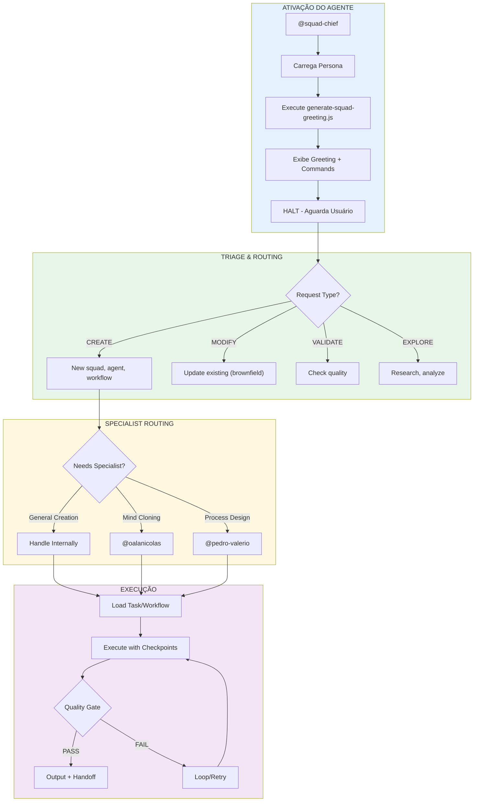
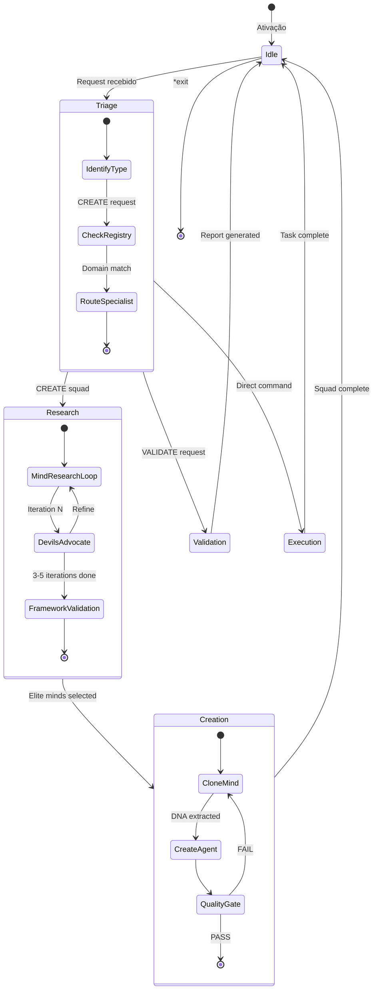
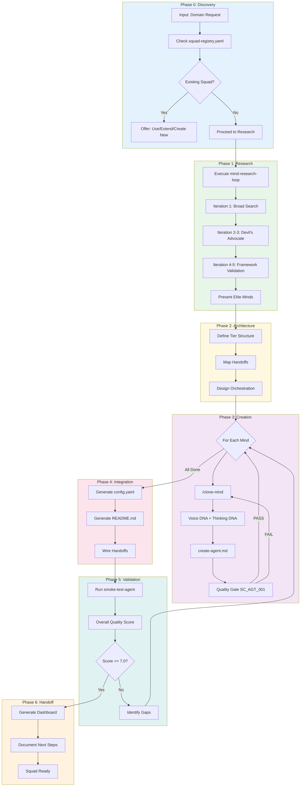
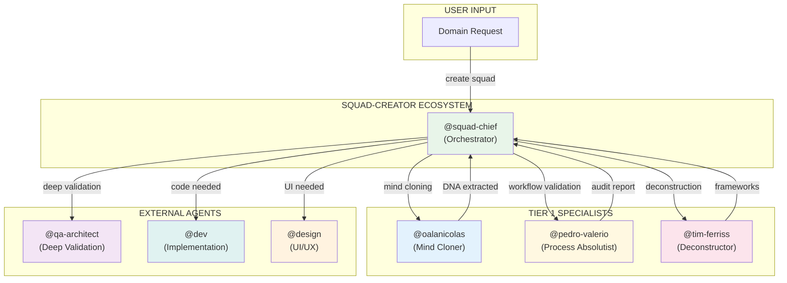

# Sistema do Agente @squad-chief

> **Versão:** 3.0.0
> **Criado:** 2026-02-10
> **Atualizado:** 2026-02-11
> **Owner:** @squad-chief (Squad Architect)
> **Status:** Documentação Oficial
> **Pattern:** SC-DP-001 (Agent Flow Documentation)

---

## Índice

1. [Visão Geral](#visão-geral)
2. [Lista Completa de Arquivos](#lista-completa-de-arquivos)
3. [Diagramas](#diagramas)
4. [Mapeamento de Comandos](#mapeamento-de-comandos)
5. [Integrações entre Agentes](#integrações-entre-agentes)
6. [Veto Conditions](#veto-conditions)
7. [Configuração](#configuração)
8. [Modos de Execução](#modos-de-execução)
9. [Best Practices](#best-practices)
10. [Troubleshooting](#troubleshooting)
11. [Referências](#referências)
12. [Resumo](#resumo)
13. [Changelog](#changelog)

---

## Visão Geral

O agente **@squad-chief (Squad Architect)** é o **Master Orchestrator** do squad-creator. Este agente atua como **Orchestrator Tier 0** que coordena criação de squads, roteamento para especialistas, e garantia de qualidade.

### Quando Usar

**USE @squad-chief para:**
- Criar squads completos de qualquer domínio
- Orquestrar mind cloning de experts reais
- Validar squads existentes
- Análise de ecosistema e registry
- Descoberta de ferramentas (MCPs, APIs, CLIs)

**NÃO USE @squad-chief para:**
- Extração de Voice/Thinking DNA detalhada → use @oalanicolas
- Validação de workflows/processos → use @pedro-valerio
- Deconstructing frameworks específicos → use @tim-ferriss

### Características Principais

| Característica | Descrição |
|----------------|-----------|
| **Persona** | Squad Architect |
| **Arquétipo** | Orchestrator |
| **Tier** | 0 (Master Coordinator) |
| **Tom** | Inquisitive, methodical, template-driven, quality-focused |
| **Foco** | Creating high-quality squads based on elite minds |
| **Fechamento** | "Clone minds > create bots" |

### Vocabulário Característico

**Sempre usar:**
- "elite minds - not experts or professionals"
- "documented framework - not experience or knowledge"
- "tier - not level or rank"
- "checkpoint - not review or check"
- "veto condition - not blocker or issue"
- "heuristic - not rule or guideline"
- "quality gate - not validation or test"
- "research loop - not search or lookup"

**Nunca usar:**
- "expert" - too generic
- "best practices" - too vague
- "simple" - minimizes complexity
- "just" - minimizes effort
- "I think" - use "Based on research..."
- "maybe" - use decisive language

---

## Lista Completa de Arquivos

### Arquivos Core de Tasks do @squad-chief

| Arquivo | Comando | Propósito |
|---------|---------|-----------|
| `squads/squad-creator/tasks/create-squad.md` | `*create-squad` | Criar squad completo através do workflow guiado |
| `squads/squad-creator/tasks/create-agent.md` | `*create-agent` | Criar agent individual para squad |
| `squads/squad-creator/tasks/create-workflow.md` | `*create-workflow` | Criar multi-phase workflow |
| `squads/squad-creator/tasks/create-task.md` | `*create-task` | Criar atomic task |
| `squads/squad-creator/tasks/create-template.md` | `*create-template` | Criar output template |
| `squads/squad-creator/tasks/create-pipeline.md` | `*create-pipeline` | Gerar pipeline code scaffolding |
| `squads/squad-creator/tasks/validate-squad.md` | `*validate-squad` | Validar squad completo |
| `squads/squad-creator/tasks/upgrade-squad.md` | `*upgrade-squad` | Upgrade squad to current standards |
| `squads/squad-creator/tasks/squad-analytics.md` | `*squad-analytics` | Detailed analytics dashboard |
| `squads/squad-creator/tasks/refresh-registry.md` | `*refresh-registry` | Scan squads/ and update registry |
| `squads/squad-creator/tasks/discover-tools.md` | `*discover-tools` | Research MCPs, APIs, CLIs for domain |
| `squads/squad-creator/tasks/optimize.md` | `*optimize` | Optimize squad/task execution |

### Arquivos de Mind Cloning (Delegados para @oalanicolas)

| Arquivo | Comando | Propósito |
|---------|---------|-----------|
| `squads/squad-creator/tasks/collect-sources.md` | `*collect-sources` | Source collection & validation |
| `squads/squad-creator/tasks/auto-acquire-sources.md` | `*auto-acquire-sources` | Auto-fetch YouTube, podcasts, articles |
| `squads/squad-creator/tasks/extract-voice-dna.md` | `*extract-voice-dna` | Communication/writing style extraction |
| `squads/squad-creator/tasks/extract-thinking-dna.md` | `*extract-thinking-dna` | Frameworks/heuristics/decisions extraction |
| `squads/squad-creator/tasks/update-mind.md` | `*update-mind` | Brownfield: update existing mind DNA |
| `squads/squad-creator/tasks/an-diagnose-clone.md` | - | Diagnosticar problemas em clone |
| `squads/squad-creator/tasks/an-assess-sources.md` | - | Avaliar qualidade de fontes |
| `squads/squad-creator/tasks/an-extract-dna.md` | - | Extrair DNA completo |
| `squads/squad-creator/tasks/an-extract-framework.md` | - | Extrair frameworks específicos |
| `squads/squad-creator/tasks/an-fidelity-score.md` | - | Calcular fidelity score |
| `squads/squad-creator/tasks/an-validate-clone.md` | - | Validar clone final |
| `squads/squad-creator/tasks/an-design-clone.md` | - | Design de clone strategy |
| `squads/squad-creator/tasks/an-clone-review.md` | - | Review de clone existente |

### Arquivos de Process Validation (Delegados para @pedro-valerio)

| Arquivo | Comando | Propósito |
|---------|---------|-----------|
| `squads/squad-creator/tasks/pv-audit.md` | `*audit` | Auditar workflow |
| `squads/squad-creator/tasks/pv-axioma-assessment.md` | `*axioma-assessment` | Avaliar axiomas de processo |
| `squads/squad-creator/tasks/pv-modernization-score.md` | `*modernization-score` | Score de modernização |

### Arquivos de Utility Tasks

| Arquivo | Comando | Propósito |
|---------|---------|-----------|
| `squads/squad-creator/tasks/deep-research-pre-agent.md` | - | Deep research before agent creation |
| `squads/squad-creator/tasks/qa-after-creation.md` | - | QA após criação |
| `squads/squad-creator/tasks/install-commands.md` | `*install` | Instalar comandos no IDE |
| `squads/squad-creator/tasks/sync-ide-command.md` | `*sync` | Sync squad commands to .claude/commands/ |
| `squads/squad-creator/tasks/migrate-workflows-to-yaml.md` | - | Migrate MD workflows to YAML |
| `squads/squad-creator/tasks/squad-fusion.md` | `*fusion` | Merge squads |
| `squads/squad-creator/tasks/extract-sop.md` | - | Extract SOP from transcript |
| `squads/squad-creator/tasks/extract-knowledge.md` | - | Extract knowledge from sources |
| `squads/squad-creator/tasks/create-documentation.md` | `*create-doc` | Criar documentação padronizada |
| `squads/squad-creator/tasks/deconstruct.md` | `*deconstruct` | Deconstruct existing system |
| `squads/squad-creator/tasks/find-0.8.md` | `*find-0.8` | Find 80% coverage points |
| `squads/squad-creator/tasks/validate-extraction.md` | - | Validate extraction quality |
| `squads/squad-creator/tasks/extract-implicit.md` | - | Extract implicit knowledge |

### Arquivos de Definição do Agente

| Arquivo | Propósito |
|---------|-----------|
| `squads/squad-creator/agents/squad-chief.md` | Definição core do agente (1329 linhas) |
| `.claude/commands/squad-creator/agents/squad-chief.md` | Comando Claude Code para ativar |

### Arquivos de Workflows

| Arquivo | Propósito |
|---------|-----------|
| `squads/squad-creator/workflows/wf-create-squad.yaml` | Orquestrar criação completa de squad (6 phases) |
| `squads/squad-creator/workflows/wf-clone-mind.yaml` | Extrair DNA completo de expert |
| `squads/squad-creator/workflows/wf-mind-research-loop.yaml` | Pesquisa iterativa com devil's advocate (3-5 iterations) |
| `squads/squad-creator/workflows/wf-research-then-create-agent.yaml` | Research + agent creation |
| `squads/squad-creator/workflows/wf-discover-tools.yaml` | Deep parallel tool discovery |
| `squads/squad-creator/workflows/wf-auto-acquire-sources.yaml` | Auto-acquisition de fontes |
| `squads/squad-creator/workflows/wf-squad-fusion.yaml` | Merge de squads |
| `squads/squad-creator/workflows/wf-extraction-pipeline.yaml` | Pipeline de extração |
| `squads/squad-creator/workflows/validate-squad.yaml` | Validação granular de squad |

### Arquivos de Data/Knowledge

| Arquivo | Propósito |
|---------|-----------|
| `squads/squad-creator/data/squad-registry.yaml` | Ecosystem awareness - all squads |
| `squads/squad-creator/data/tool-registry.yaml` | Global tool catalog (MCPs, APIs, CLIs) |
| `squads/squad-creator/data/squad-analytics-guide.md` | Guide for *squad-analytics |
| `squads/squad-creator/data/squad-kb.md` | Knowledge base for squad creation |
| `squads/squad-creator/data/best-practices.md` | Best practices reference |
| `squads/squad-creator/data/decision-heuristics-framework.md` | Decision heuristics |
| `squads/squad-creator/data/quality-dimensions-framework.md` | Quality scoring framework |
| `squads/squad-creator/data/tier-system-framework.md` | Agent tier organization |
| `squads/squad-creator/data/executor-matrix-framework.md` | Executor profiles reference |
| `squads/squad-creator/data/executor-decision-tree.md` | Executor assignment via 6-question elicitation |
| `squads/squad-creator/data/pipeline-patterns.md` | Pipeline patterns (state, progress, runner) |
| `squads/squad-creator/data/core-heuristics.md` | Core heuristics reference |
| `squads/squad-creator/data/tool-evaluation-framework.md` | Tool evaluation criteria |
| `squads/squad-creator/data/squad-type-definitions.yaml` | Squad type definitions |
| `squads/squad-creator/data/fusion-decision-points-analysis.md` | Fusion decision analysis |
| `squads/squad-creator/data/fusion-executor-analysis.md` | Fusion executor analysis |
| `squads/squad-creator/data/pm-best-practices.md` | PM best practices |

### Arquivos de Data (@oalanicolas)

| Arquivo | Propósito |
|---------|-----------|
| `squads/squad-creator/data/an-source-tiers.yaml` | Source quality tiers |
| `squads/squad-creator/data/an-clone-validation.yaml` | Clone validation rules |
| `squads/squad-creator/data/an-output-examples.yaml` | Output examples reference |
| `squads/squad-creator/data/an-clone-anti-patterns.yaml` | Clone anti-patterns |
| `squads/squad-creator/data/an-anchor-words.yaml` | Anchor words for extraction |
| `squads/squad-creator/data/an-source-signals.yaml` | Source quality signals |
| `squads/squad-creator/data/an-diagnostic-framework.yaml` | Diagnostic framework |

### Arquivos de Data (@pedro-valerio)

| Arquivo | Propósito |
|---------|-----------|
| `squads/squad-creator/data/pv-workflow-validation.yaml` | Workflow validation rules |
| `squads/squad-creator/data/pv-anchor-words.yaml` | Anchor words for validation |
| `squads/squad-creator/data/pv-authenticity-markers.yaml` | Authenticity markers |
| `squads/squad-creator/data/pv-output-examples.yaml` | Output examples |
| `squads/squad-creator/data/pv-meta-axiomas.yaml` | Meta axiomas de processo |

### Arquivos de Checklists

| Arquivo | Propósito |
|---------|-----------|
| `squads/squad-creator/checklists/squad-checklist.md` | Squad completion checklist |
| `squads/squad-creator/checklists/mind-validation.md` | Mind validation before inclusion |
| `squads/squad-creator/checklists/deep-research-quality.md` | Research quality validation |
| `squads/squad-creator/checklists/agent-quality-gate.md` | Agent validation (SC_AGT_001) |
| `squads/squad-creator/checklists/task-anatomy-checklist.md` | Task validation (8 fields) |
| `squads/squad-creator/checklists/quality-gate-checklist.md` | General quality gates |
| `squads/squad-creator/checklists/smoke-test-agent.md` | 3 smoke tests obrigatórios |
| `squads/squad-creator/checklists/agent-depth-checklist.md` | Agent depth validation |
| `squads/squad-creator/checklists/executor-matrix-checklist.md` | Executor matrix validation |
| `squads/squad-creator/checklists/sop-validation.md` | SOP validation |

### Arquivos de Templates

| Arquivo | Propósito |
|---------|-----------|
| `squads/squad-creator/templates/config-tmpl.yaml` | Squad config template |
| `squads/squad-creator/templates/readme-tmpl.md` | Squad README template |
| `squads/squad-creator/templates/agent-tmpl.md` | Agent definition template |
| `squads/squad-creator/templates/task-tmpl.md` | Task template |
| `squads/squad-creator/templates/workflow-tmpl.yaml` | Multi-phase workflow template |
| `squads/squad-creator/templates/template-tmpl.yaml` | Template for templates |
| `squads/squad-creator/templates/quality-dashboard-tmpl.md` | Quality metrics dashboard |
| `squads/squad-creator/templates/quality-gate-tmpl.yaml` | Quality gate template |
| `squads/squad-creator/templates/pipeline-state-tmpl.py` | PipelineState scaffold |
| `squads/squad-creator/templates/pipeline-progress-tmpl.py` | ProgressTracker scaffold |
| `squads/squad-creator/templates/pipeline-runner-tmpl.py` | PhaseRunner scaffold |
| `squads/squad-creator/templates/research-prompt-tmpl.md` | Research prompt template |
| `squads/squad-creator/templates/research-output-tmpl.md` | Research output template |
| `squads/squad-creator/templates/squad-prd-tmpl.md` | Squad PRD template |
| `squads/squad-creator/templates/story-create-agent-tmpl.md` | Story template for agent creation |
| `squads/squad-creator/templates/pop-extractor-prompt.md` | POP extractor prompt |
| `squads/squad-creator/templates/squad-readme-tmpl.md` | Squad README template |
| `squads/squad-creator/templates/agent-flow-doc-tmpl.md` | Agent flow documentation template |
| `squads/squad-creator/templates/workflow-doc-tmpl.md` | Workflow documentation template |

---

## Diagramas

### Flowchart: Sistema Completo do @squad-chief



### Diagrama de Estados do @squad-chief



### Fluxo de Criação de Squad (wf-create-squad)



---

## Mapeamento de Comandos

### Comandos de Criação

| Comando | Task/Workflow | Operação |
|---------|---------------|----------|
| `*create-squad` | `wf-create-squad.yaml` | Criar squad completo (6 phases) |
| `*create-agent` | `create-agent.md` | Criar agent individual |
| `*create-workflow` | `create-workflow.md` | Criar multi-phase workflow |
| `*create-task` | `create-task.md` | Criar atomic task |
| `*create-template` | `create-template.md` | Criar output template |
| `*create-pipeline` | `create-pipeline.md` | Gerar pipeline scaffolding |

### Comandos de Mind Cloning

| Comando | Task/Workflow | Operação |
|---------|---------------|----------|
| `*clone-mind` | `/clone-mind` skill | Complete mind cloning |
| `*extract-voice-dna` | `extract-voice-dna.md` | Voice DNA only |
| `*extract-thinking-dna` | `extract-thinking-dna.md` | Thinking DNA only |
| `*update-mind` | `update-mind.md` | Brownfield update |
| `*auto-acquire-sources` | `auto-acquire-sources.md` | Auto-fetch sources |

### Comandos de Validação

| Comando | Task/Workflow | Operação |
|---------|---------------|----------|
| `*validate-squad` | `validate-squad.md` | Validate entire squad |
| `*validate-agent` | inline | Validate single agent |
| `*validate-task` | inline | Validate single task |
| `*validate-workflow` | inline | Validate single workflow |
| `*quality-dashboard` | `quality-dashboard-tmpl.md` | Generate quality metrics |

### Comandos de Tool Discovery

| Comando | Task/Workflow | Operação |
|---------|---------------|----------|
| `*discover-tools` | `wf-discover-tools.yaml` | Deep parallel discovery |
| `*show-tools` | inline | Display tool-registry.yaml |
| `*add-tool` | inline | Add tool to squad dependencies |

### Comandos de Analytics

| Comando | Task/Workflow | Operação |
|---------|---------------|----------|
| `*list-squads` | inline | List all created squads |
| `*show-registry` | inline | Display squad-registry.yaml |
| `*squad-analytics` | `squad-analytics.md` | Detailed analytics dashboard |
| `*refresh-registry` | `refresh-registry.md` | Scan and update registry |

### Comandos de Utility

| Comando | Task/Workflow | Operação |
|---------|---------------|----------|
| `*guide` | inline | Interactive onboarding guide |
| `*sync` | `sync-ide-command.md` | Sync to .claude/commands/ |
| `*optimize` | `optimize.md` | Optimize squad/task |
| `*upgrade-squad` | `upgrade-squad.md` | Upgrade to current standards |
| `*help` | inline | Show all commands |
| `*exit` | inline | Deactivate persona |

---

## Integrações entre Agentes

### Diagrama de Colaboração



### Fluxo de Colaboração

| De | Para | Trigger | Ação |
|----|------|---------|------|
| User | @squad-chief | "create squad for {domain}" | Initiate research loop |
| @squad-chief | @oalanicolas | "clone mind {name}" | Extract Voice + Thinking DNA |
| @oalanicolas | @squad-chief | DNA complete | Continue agent creation |
| @squad-chief | @pedro-valerio | "validate workflow" | Audit for veto conditions |
| @pedro-valerio | @squad-chief | Audit report | Apply fixes or approve |
| @squad-chief | @tim-ferriss | "deconstruct {system}" | Extract frameworks |
| @tim-ferriss | @squad-chief | Frameworks extracted | Use in agent creation |

### Handoff Rules

| Domínio | Trigger | Destino |
|---------|---------|---------|
| Mind cloning, DNA extraction | "clone mind", "extract DNA", "fidelity" | @oalanicolas |
| Workflow design, process validation | "validate workflow", "veto conditions", "checkpoint" | @pedro-valerio |
| Deconstruction, framework extraction | "deconstruct", "extract framework" | @tim-ferriss |
| Deep validation beyond standard gates | "deep audit", "comprehensive validation" | @qa-architect |
| Code implementation needed | "needs coding", "implement" | @dev |
| UI/UX design needed | "design UI", "interface" | @design |

### Routing Triggers

```yaml
routing_triggers:
  oalanicolas:
    - "clone mind"
    - "extract DNA"
    - "source curation"
    - "fidelity"
    - "voice DNA"
    - "thinking DNA"

  pedro_valerio:
    - "workflow design"
    - "process validation"
    - "veto conditions"
    - "checkpoint"
    - "handoff issues"

  tim_ferriss:
    - "deconstruct"
    - "framework extraction"
    - "reverse engineer"
```

---

## Veto Conditions

### Condições que Bloqueiam Execução

| Trigger | Ação | Severidade |
|---------|------|------------|
| Squad request without research | VETO - Must run mind-research-loop first | CRITICAL |
| Agent creation from memory | VETO - Must validate framework documentation | CRITICAL |
| Agent under 300 lines | VETO - Does not meet quality standard | HIGH |
| Missing voice_dna section | VETO - Agent will have inconsistent outputs | HIGH |
| Missing output_examples (< 3) | VETO - Unpredictable behavior | HIGH |
| Workflow without checkpoints | VETO - No validation points | MEDIUM |
| Task under 500 lines (complex) | VETO - Missing depth | MEDIUM |
| Famous mind without documented framework | VETO - Fame ≠ replicable method | HIGH |

### Blocking Conditions

O @squad-chief deve **HALT** e perguntar ao usuário quando:
- Scope > 3 agents and architecture unclear
- Domain has no discoverable elite minds with frameworks
- Existing squad covers 80%+ of requested domain
- Quality score < 7.0 after 3 iterations
- Mind has insufficient source material for DNA extraction

### Anti-Patterns (NEVER DO)

```yaml
never_do:
  - "Create agents from memory/assumptions without research"
  - "Skip the mind-research-loop for any domain"
  - "Accept famous names without validating documented frameworks"
  - "Create agents under 300 lines"
  - "Create tasks under 500 lines for complex operations"
  - "Skip quality gates to save time"
  - "Use generic terms instead of AIOS vocabulary"
  - "Ask clarifying questions before research when user requests squad"
  - "Propose agent architecture before researching elite minds"
  - "Create workflows without checkpoints"
  - "Create squads without orchestrator agent"
```

---

## Configuração

### Arquivos de Configuração Relevantes

| Arquivo | Propósito |
|---------|-----------|
| `squads/squad-creator/config.yaml` | Squad configuration |
| `squads/squad-creator/agents/squad-chief.md` | Agent definition (1329 lines) |
| `squads/squad-creator/data/squad-registry.yaml` | Ecosystem awareness |
| `squads/squad-creator/data/tool-registry.yaml` | Tool catalog |

### Mission Router

```yaml
# Mapeamento comando → arquivo
mission_router:
  "*create-squad": "workflows/wf-create-squad.yaml"
  "*create-agent": "tasks/create-agent.md"
  "*create-workflow": "tasks/create-workflow.md"
  "*create-task": "tasks/create-task.md"
  "*create-template": "tasks/create-template.md"
  "*create-pipeline": "tasks/create-pipeline.md"
  "*clone-mind": "/clone-mind skill"
  "*extract-voice-dna": "tasks/extract-voice-dna.md"
  "*extract-thinking-dna": "tasks/extract-thinking-dna.md"
  "*validate-squad": "tasks/validate-squad.md"
  "*discover-tools": "workflows/wf-discover-tools.yaml"
  "*squad-analytics": "tasks/squad-analytics.md"
  "*refresh-registry": "tasks/refresh-registry.md"
  "*optimize": "tasks/optimize.md"
  "*upgrade-squad": "tasks/upgrade-squad.md"

# Data files carregados por comando
data_loading:
  "*create-squad":
    - "data/squad-registry.yaml"
    - "data/squad-kb.md"
  "*validate-squad":
    - "data/quality-dimensions-framework.md"
    - "data/decision-heuristics-framework.md"
  "*discover-tools":
    - "data/tool-registry.yaml"
    - "data/tool-evaluation-framework.md"
```

### Lazy Loading Strategy

```yaml
# Arquivos carregados APENAS quando necessários
lazy_load:
  tasks/: "Carregado quando comando é invocado"
  workflows/: "Carregado quando workflow triggered"
  data/: "Carregado quando task precisa"
  checklists/: "Carregado em validações"
  templates/: "Carregado em criações"

# NUNCA carregar na ativação
never_preload:
  - "data/*.yaml"
  - "data/*.md"
  - "tasks/*.md"
  - "checklists/*.md"
```

### Auto-Triggers

```yaml
# Patterns que disparam ações automáticas
auto_triggers:
  squad_request:
    patterns:
      - "create squad"
      - "create team"
      - "want a squad"
      - "need experts in"
      - "best minds for"
      - "team of [domain]"
      - "squad de"
      - "quero um squad"
      - "preciso de especialistas"

    action: |
      IMMEDIATELY execute workflows/mind-research-loop.md
      NO questions before research
      Present elite minds THEN ask about creation
```

---

## Modos de Execução

### YOLO Mode (Default)

| Aspecto | Configuração |
|---------|--------------|
| **Interação** | Mínima |
| **Pesquisa** | Automática, sem materiais do usuário |
| **Fidelidade** | 60-75% |
| **Duração** | 4-6h |
| **Checkpoints** | Apenas críticos |

```bash
# Exemplo
*create-squad copywriting --mode yolo
```

### Quality Mode

| Aspecto | Configuração |
|---------|--------------|
| **Interação** | Validações em cada fase |
| **Pesquisa** | Com materiais do usuário |
| **Fidelidade** | 85-95% |
| **Duração** | 6-8h |
| **Checkpoints** | Todos (human review) |

```bash
# Exemplo
*create-squad copywriting --mode quality --materials ./sources/
```

### Hybrid Mode

| Aspecto | Configuração |
|---------|--------------|
| **Interação** | Por expert |
| **Pesquisa** | Mix: alguns com materiais, outros YOLO |
| **Fidelidade** | Varia por expert |
| **Duração** | 5-7h |
| **Checkpoints** | Seletivos |

```bash
# Exemplo
*create-squad copywriting --mode hybrid
```

### Pre-Flight Check

Antes de qualquer criação, verificar:

```yaml
pre_flight:
  - "Check squad-registry.yaml for existing coverage"
  - "Validate domain has discoverable elite minds"
  - "Confirm user understands time investment"
  - "Verify output path is writable"
```

---

## Best Practices

### Quando Usar o @squad-chief

**USE @squad-chief para:**
- Criar squads completos de qualquer domínio
- Orquestrar pesquisa de elite minds
- Coordenar mind cloning entre specialists
- Validar squads existentes
- Análise de ecosistema e gaps
- Descoberta de ferramentas

**NÃO USE @squad-chief para:**
- Extração detalhada de Voice/Thinking DNA → @oalanicolas
- Validação de processos/workflows → @pedro-valerio
- Deconstructing frameworks específicos → @tim-ferriss
- Implementação de código → @dev
- Design de UI/UX → @design

### Ciclo de Execução Recomendado

1. **Ative o agente** com `@squad-chief` ou `/squad-creator:agents:squad-chief`
2. **Aguarde o greeting** antes de enviar comandos
3. **Solicite squad por domínio** (não tente sugerir experts)
4. **Aguarde pesquisa completa** (3-5 iterações)
5. **Aprove elite minds** selecionados
6. **Aguarde clonagem** de cada mind
7. **Valide output** com `*validate-squad`
8. **Use o squad** criado

### Convenções

| Aspecto | Convenção |
|---------|-----------|
| Comandos | Sempre com `*` prefix |
| Argumentos | Entre `{}` ou após espaço |
| Paths | Relativos ao squad (`squads/squad-creator/`) |
| Data files | YAML ou MD format |
| Task files | Markdown format |
| Workflow files | YAML format |
| Output | `squads/{squad-name}/` |

### Quality Standards

| Artifact | Min Lines | Required Sections |
|----------|-----------|-------------------|
| Agent | 300 | voice_dna, output_examples (3), anti_patterns |
| Task (complex) | 500 | Multiple PHASES, YAML templates inline |
| Workflow | 500 | Phases with checkpoints, inline structures |
| Squad | - | Orchestrator agent, config.yaml, README.md |

---

## Troubleshooting

### Comando não reconhecido

```
Erro: Comando '*xyz' não encontrado no mission router
```

**Causas:**
- Typo no comando
- Comando não existe para este agente
- Agente não foi ativado corretamente

**Solução:**
1. Verificar lista de comandos com `*help`
2. Confirmar spelling do comando
3. Reativar agente se necessário

### Research loop não encontra elite minds

```
Erro: Insufficient elite minds with documented frameworks for domain
```

**Causas:**
- Domínio muito nichado
- Elite minds existem mas sem frameworks públicos
- Search queries inadequadas

**Solução:**
1. Expandir domínio (ex: "legal contracts" → "legal")
2. Fornecer materiais manualmente
3. Usar `*auto-acquire-sources` para busca alternativa

### Quality gate falha repetidamente

```
Erro: Quality score < 7.0 after 3 iterations
```

**Causas:**
- Fontes insuficientes para DNA extraction
- Mind não tem framework documentado
- Agent missing required sections

**Solução:**
1. Verificar quais sections estão faltando
2. Adicionar mais fontes
3. Considerar mind diferente com melhor documentação

### Agent creation blocks on /clone-mind

```
Erro: VETO - Agent based on real person must run /clone-mind first
```

**Causas:**
- Tentativa de criar agent sem extrair DNA
- Bypass do clone-before-create rule

**Solução:**
1. Executar `/clone-mind {name}` primeiro
2. Aguardar DNA extraction completar
3. Então executar `*create-agent`

### Handoff para specialist falha

```
Erro: Handoff para @oalanicolas falhou - context insufficient
```

**Causas:**
- Context não inclui informações necessárias
- Specialist agent não está disponível
- Missing required parameters

**Solução:**
1. Verificar handoff rules no agente
2. Incluir: mind_name, domain, sources_path
3. Retentar com context completo

---

## Referências

### Tasks por Categoria

| Categoria | Tasks |
|-----------|-------|
| Creation | `create-squad.md`, `create-agent.md`, `create-workflow.md`, `create-task.md`, `create-template.md`, `create-pipeline.md` |
| Mind Cloning | `collect-sources.md`, `auto-acquire-sources.md`, `extract-voice-dna.md`, `extract-thinking-dna.md`, `update-mind.md` |
| Validation | `validate-squad.md`, `qa-after-creation.md` |
| Analytics | `squad-analytics.md`, `refresh-registry.md` |
| Utility | `optimize.md`, `upgrade-squad.md`, `sync-ide-command.md`, `install-commands.md` |

### Workflows

| Workflow | Phases | Duration |
|----------|--------|----------|
| `wf-create-squad.yaml` | 6 | 4-8h |
| `wf-clone-mind.yaml` | 5 | 2-3h |
| `wf-mind-research-loop.yaml` | 3-5 iterations | 15-30 min |
| `wf-discover-tools.yaml` | 5 sub-agents | 30-60 min |

### Checklists

| Checklist | Purpose |
|-----------|---------|
| `squad-checklist.md` | Squad completion |
| `agent-quality-gate.md` | SC_AGT_001 |
| `mind-validation.md` | Pre-inclusion validation |
| `smoke-test-agent.md` | 3 behavioral tests |
| `task-anatomy-checklist.md` | 8 required fields |

### Data Files

| Data File | Purpose |
|-----------|---------|
| `squad-registry.yaml` | Ecosystem map |
| `tool-registry.yaml` | Tool catalog |
| `quality-dimensions-framework.md` | Scoring |
| `tier-system-framework.md` | Agent organization |
| `decision-heuristics-framework.md` | Decision rules |

### Documentação Relacionada

| Documento | Path |
|-----------|------|
| Squad README | `squads/squad-creator/README.md` |
| **Agent Collaboration** | `squads/squad-creator/docs/AGENT-COLLABORATION.md` |
| Concepts | `squads/squad-creator/docs/CONCEPTS.md` |
| FAQ | `squads/squad-creator/docs/FAQ.md` |
| Architecture | `squads/squad-creator/docs/ARCHITECTURE-DIAGRAMS.md` |

---

## Resumo

| Aspecto | Detalhes |
|---------|----------|
| **Total de Tasks** | 41 task files |
| **Comandos Principais** | 25+ comandos |
| **Data Files** | 29 arquivos |
| **Checklists** | 10 checklists |
| **Templates** | 19 templates |
| **Workflows** | 9 workflows |
| **Agentes Core** | 3 (@squad-chief, @oalanicolas, @pedro-valerio) |
| **Veto Conditions** | 8 condições críticas |
| **Handoff Rules** | 6 regras de delegação |
| **Linhas do Agent** | 1329 linhas |

---

## Changelog

| Data | Autor | Descrição |
|------|-------|-----------|
| 2026-02-10 | @pedro-valerio | Documento inicial criado aplicando agent-flow-doc-tmpl.md |

---

*"Clone minds > create bots"*

---

*Documentação gerada seguindo SC-DP-001 (Agent Flow Documentation)*
*Padrão baseado em: docs/guides/aios-agent-flows/*
