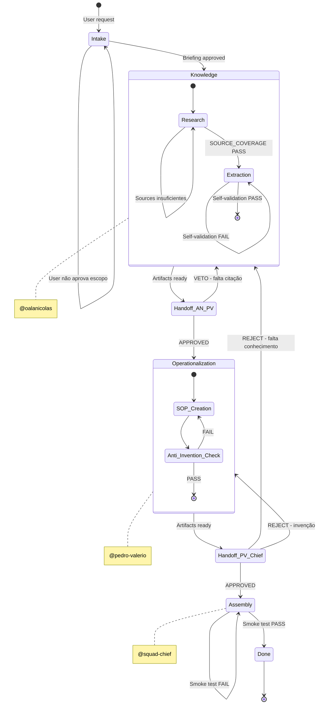
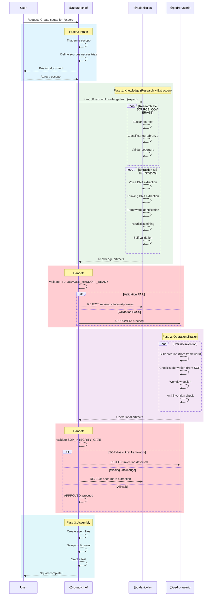
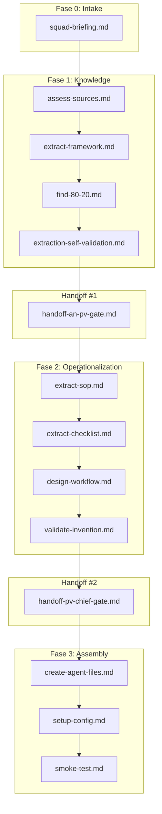
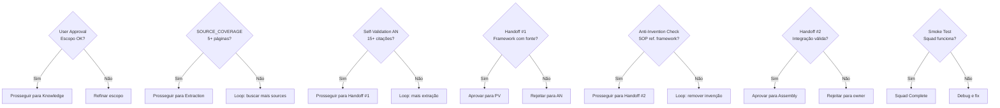
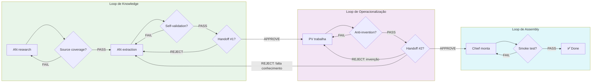

# Workflow: Squad Creation Pipeline

**Versão:** 2.0
**Tipo:** Workflow de Criação de Squads
**Autores:** @oalanicolas (Knowledge Architect) + @pedro-valerio (Process Architect)
**Data de Criação:** 2026-02-10
**Última Atualização:** 2026-02-10
**Tags:** squad, creation, extraction, operationalization, pipeline, AN, PV

---

## Visão Geral

O **Squad Creation Pipeline** é o workflow completo para criação de squads baseados em experts. Ele implementa a separação fundamental entre **Knowledge** (extração de conhecimento) e **Operationalization** (transformação em processos executáveis).

### Objetivo

Garantir que squads sejam criados com:
1. **Conhecimento autêntico** - Extraído de fontes reais, não inventado
2. **Processos à prova de erro** - Operacionalizados com veto conditions
3. **Rastreabilidade completa** - Citações, fontes, e validações documentadas

### Princípio Fundamental

```
KNOWLEDGE ≠ OPERATIONALIZATION

@oalanicolas (Knowledge Architect) extrai "O QUE o expert sabe/pensa"
@pedro-valerio (Process Architect) transforma em "COMO fazer sem errar"
```

### Arquitetura de 3 Agentes

```
┌────────────┐     ┌───────────────────────┐     ┌────────────────┐     ┌────────────┐
│   CHIEF    │ ──► │    @oalanicolas       │ ──► │ @pedro-valerio │ ──► │   CHIEF    │
│  (triage)  │     │ (research+extraction) │     │ (operationalize)│     │ (assembly) │
└────────────┘     └───────────────────────┘     └────────────────┘     └────────────┘
```

### Tipos de Projeto Suportados

| Tipo | Descrição |
|------|-----------|
| `mind-clone` | Clonagem de expert individual (funcional, não perfeito) |
| `multi-mind` | Squad com múltiplos experts clonados |
| `domain-squad` | Squad temático (ex: Copy, Design, Data) |
| `hybrid-squad` | Combinação de minds clonados + agents funcionais |

---

## Arquitetura de Responsabilidades

### Regra de Ouro

| Se o artefato responde... | Owner |
|---------------------------|-------|
| "O que ele pensa?" | @oalanicolas |
| "Como ele decide?" | @oalanicolas |
| "Qual o modelo mental?" | @oalanicolas |
| "Quais as heurísticas?" | @oalanicolas |
| "Como fazer sem errar?" | @pedro-valerio |
| "Qual a sequência?" | @pedro-valerio |
| "Como validar?" | @pedro-valerio |

### Mapeamento de Artefatos

| Artefato | Tipo | Owner |
|----------|------|-------|
| `*-framework.md` | Knowledge | @oalanicolas |
| `*_dna.yaml` | Knowledge | @oalanicolas |
| `core_principles.yaml` | Knowledge | @oalanicolas |
| `mental_models.yaml` | Knowledge | @oalanicolas |
| `heuristics.yaml` | Knowledge | @oalanicolas |
| `signature_phrases.yaml` | Knowledge | @oalanicolas |
| `source-index.yaml` | Knowledge | @oalanicolas |
| `*-sop.md` | Operationalization | @pedro-valerio |
| `*-checklist.md` | Operationalization | @pedro-valerio |
| `*-workflow.yaml` | Operationalization | @pedro-valerio |
| `*-blueprint.yaml` | Operationalization | @pedro-valerio |

---

## Diagrama Mermaid do Workflow

### Pipeline Completo

```mermaid
flowchart TB
    subgraph PHASE_0["Fase 0: INTAKE"]
        START([User Request]) --> CHIEF["@squad-chief<br/>Triagem"]
        CHIEF --> BRIEFING["📋 Briefing Document<br/>• Expert target<br/>• Domain<br/>• Sources hints<br/>• Agents needed"]
        BRIEFING --> USER_APPROVAL{"User aprova<br/>escopo?"}
        USER_APPROVAL -->|Não| CHIEF
    end

    subgraph PHASE_1["Fase 1: KNOWLEDGE (Research + Extraction)"]
        USER_APPROVAL -->|Sim| AN["@oalanicolas<br/>Knowledge Architect"]
        AN --> AN_RESEARCH["Research:<br/>• Buscar sources<br/>• Classificar ouro/bronze<br/>• Validar cobertura"]
        AN_RESEARCH --> SOURCE_GATE{"SOURCE_COVERAGE<br/>5+ páginas?<br/>3+ citações?"}
        SOURCE_GATE -->|FAIL| AN_RESEARCH
        SOURCE_GATE -->|PASS| AN_EXTRACT["Extraction:<br/>• Voice DNA<br/>• Thinking DNA<br/>• Frameworks<br/>• Heuristics<br/>• Mental Models"]
        AN_EXTRACT --> AN_VALIDATE{"Self-Validation<br/>15+ citações?<br/>5+ phrases?"}
        AN_VALIDATE -->|FAIL| AN_EXTRACT
        AN_VALIDATE -->|PASS| KNOWLEDGE_ARTIFACTS["📦 KNOWLEDGE ARTIFACTS<br/>• {expert}_dna.yaml<br/>• core_principles.yaml<br/>• heuristics.yaml<br/>• frameworks/*.md"]
    end

    subgraph HANDOFF_1["🚦 HANDOFF #1: AN → PV"]
        KNOWLEDGE_ARTIFACTS --> GATE_1{"FRAMEWORK_HANDOFF_READY<br/>• 15+ citações?<br/>• Voice verificável?<br/>• Thinking aplicável?<br/>• Zero inferências?"}
        GATE_1 -->|REJECT| AN_EXTRACT
        GATE_1 -->|APPROVED| PV
    end

    subgraph PHASE_2["Fase 2: OPERATIONALIZATION"]
        PV["@pedro-valerio<br/>Process Architect"]
        PV --> PV_WORK["Executa:<br/>• SOPs (do framework)<br/>• Checklists (do SOP)<br/>• Workflows<br/>• Veto Conditions<br/>• Quality Gates"]
        PV_WORK --> PV_VALIDATE{"Anti-Invention Check<br/>SOP ref. framework?<br/>Zero conceitos novos?"}
        PV_VALIDATE -->|FAIL| PV_WORK
        PV_VALIDATE -->|PASS| OPERATIONAL_ARTIFACTS["📦 OPERATIONAL ARTIFACTS<br/>• sops/*.md<br/>• checklists/*.md<br/>• workflows/*.yaml<br/>• blueprints/*.yaml"]
    end

    subgraph HANDOFF_2["🚦 HANDOFF #2: PV → CHIEF"]
        OPERATIONAL_ARTIFACTS --> GATE_2{"SOP_INTEGRITY_GATE<br/>• SOP ref. framework?<br/>• Checklist ref. SOP?<br/>• Paths corretos?"}
        GATE_2 -->|REJECT: invenção| PV_WORK
        GATE_2 -->|REJECT: falta conhecimento| AN_EXTRACT
        GATE_2 -->|APPROVED| ASSEMBLY
    end

    subgraph PHASE_3["Fase 3: ASSEMBLY"]
        ASSEMBLY["@squad-chief<br/>ASSEMBLY"]
        ASSEMBLY --> ASSEMBLY_WORK["Executa:<br/>• Agent files<br/>• Config.yaml<br/>• Routing setup<br/>• Inter-agent refs"]
        ASSEMBLY_WORK --> SMOKE{"SMOKE TEST<br/>• Agent carrega?<br/>• Commands funcionam?<br/>• Paths resolvem?"}
        SMOKE -->|FAIL| ASSEMBLY_WORK
        SMOKE -->|PASS| OUTPUT
    end

    subgraph PHASE_4["Fase 4: OUTPUT"]
        OUTPUT["📦 SQUAD COMPLETO"]
        OUTPUT --> STRUCTURE["squads/{squad-name}/<br/>├── agents/<br/>├── tasks/<br/>├── checklists/<br/>├── workflows/<br/>├── sops/<br/>├── templates/<br/>├── data/<br/>│   └── minds/<br/>└── config.yaml"]
    end

    style PHASE_0 fill:#e1f5fe
    style PHASE_1 fill:#e8f5e9
    style HANDOFF_1 fill:#ffcdd2
    style PHASE_2 fill:#f3e5f5
    style HANDOFF_2 fill:#ffcdd2
    style PHASE_3 fill:#e0f7fa
    style PHASE_4 fill:#c8e6c9
```



### Diagrama de Estados



### Diagrama de Sequência



---

## Steps Detalhados

### Step 0: Intake (Fase 0)

| Campo | Valor |
|-------|-------|
| **ID** | `intake` |
| **Agente** | @squad-chief |
| **Ação** | Triagem e criação de briefing |

#### Inputs

| Input | Tipo | Origem | Obrigatório |
|-------|------|--------|-------------|
| `expert_name` | string | User Input | Sim |
| `domain` | string | User Input | Sim |
| `sources_hints` | array | User Input | Não |
| `agents_count` | number | User Input | Não |

#### Outputs

| Output | Tipo | Destino |
|--------|------|---------|
| `briefing.yaml` | arquivo | `docs/projects/{squad}/briefing.yaml` |
| `expert_slug` | string | Contexto do workflow |

#### Gate: USER_APPROVAL

- User deve aprovar escopo antes de gastar tokens em research
- Se escopo muito amplo → Chief refina
- Se sources insuficientes conhecidas → Chief alerta

---

### Step 1: Knowledge - Research (Fase 1a)

| Campo | Valor |
|-------|-------|
| **ID** | `research` |
| **Agente** | @oalanicolas |
| **Ação** | Buscar e curar sources |
| **Requer** | `intake` + User approval |

#### Inputs

| Input | Tipo | Origem | Obrigatório |
|-------|------|--------|-------------|
| `briefing.yaml` | arquivo | Step anterior | Sim |
| `expert_name` | string | Briefing | Sim |
| `source_hints` | array | User | Não |

#### Outputs

| Output | Tipo | Destino |
|--------|------|---------|
| `source-index.yaml` | arquivo | `squads/{squad}/data/source-index.yaml` |
| `transcripts/` | diretório | `squads/{squad}/data/transcripts/` |
| `citations.yaml` | arquivo | `squads/{squad}/data/citations.yaml` |

#### Gate: SOURCE_COVERAGE (interno a AN)

| Critério | Threshold | Ação se FAIL |
|----------|-----------|--------------|
| Páginas/minutos de conteúdo | ≥ 5 | Buscar mais sources |
| Citações diretas utilizáveis | ≥ 3 | Procurar entrevistas/podcasts |
| Tipos de source | ≥ 2 | Diversificar (livro + video + entrevista) |

---

### Step 2: Knowledge - Extraction (Fase 1b)

| Campo | Valor |
|-------|-------|
| **ID** | `extraction` |
| **Agente** | @oalanicolas |
| **Ação** | Extrair conhecimento do expert |
| **Requer** | `research` com SOURCE_COVERAGE PASS |

#### Inputs

| Input | Tipo | Origem | Obrigatório |
|-------|------|--------|-------------|
| `source-index.yaml` | arquivo | Step anterior | Sim |
| `transcripts/` | diretório | Step anterior | Sim |
| `citations.yaml` | arquivo | Step anterior | Sim |

#### Outputs

| Output | Tipo | Destino |
|--------|------|---------|
| `{expert}_dna.yaml` | arquivo | `squads/{squad}/data/minds/` |
| `core_principles.yaml` | arquivo | `squads/{squad}/data/minds/` |
| `heuristics.yaml` | arquivo | `squads/{squad}/data/minds/` |
| `mental_models.yaml` | arquivo | `squads/{squad}/data/minds/` |
| `signature_phrases.yaml` | arquivo | `squads/{squad}/data/minds/` |
| `frameworks/*.md` | diretório | `squads/{squad}/docs/frameworks/` |

#### Checklist de Self-Validation

- [ ] 15+ citações diretas com [SOURCE: página/minuto]
- [ ] Voice DNA com 5+ signature phrases verificáveis
- [ ] Thinking DNA com decision architecture mapeada
- [ ] Heuristics com contexto de aplicação (QUANDO usar)
- [ ] Anti-patterns documentados do EXPERT (não genéricos)
- [ ] Nenhum conceito marcado como "inferido" sem fonte
- [ ] Cada framework referencia source original

#### Veto Conditions (Self)

| Trigger | Ação |
|---------|------|
| < 15 citações | LOOP - voltar para extração |
| Conceito sem fonte | LOOP - documentar ou remover |
| Framework genérico | LOOP - especificar com exemplos do expert |
| Heuristic sem contexto | LOOP - adicionar "QUANDO aplicar" |

---

### Handoff #1: AN → PV

| Campo | Valor |
|-------|-------|
| **ID** | `handoff_an_pv` |
| **De** | @oalanicolas |
| **Para** | @pedro-valerio |
| **Gate** | FRAMEWORK_HANDOFF_READY |

#### Veto Conditions

| Trigger | Ação | Destino |
|---------|------|---------|
| Framework sem citações de fonte | REJECT | @oalanicolas |
| DNA sem signature phrases reais | REJECT | @oalanicolas |
| Heurísticas sem contexto de aplicação | REJECT | @oalanicolas |
| Conceito inventado detectado | REJECT | @oalanicolas |

#### Critérios de Aprovação

AN entrega framework QUANDO:
- [ ] 15+ citações diretas com fonte
- [ ] Voice DNA com 5+ signature phrases verificáveis
- [ ] Thinking DNA com decision architecture mapeada
- [ ] Anti-patterns documentados do EXPERT (não genéricos)
- [ ] Nenhum conceito marcado como "inferido" sem fonte

PV recebe APENAS SE:
- [ ] Framework passou no checklist acima
- [ ] Nenhum conceito marcado como "inferido" sem fonte

---

### Step 3: Operationalization (Fase 2)

| Campo | Valor |
|-------|-------|
| **ID** | `operationalization` |
| **Agente** | @pedro-valerio |
| **Ação** | Transformar conhecimento em processos |
| **Requer** | `handoff_an_pv` APPROVED |

#### Inputs

| Input | Tipo | Origem | Obrigatório |
|-------|------|--------|-------------|
| `{expert}_dna.yaml` | arquivo | Step anterior | Sim |
| `frameworks/*.md` | diretório | Step anterior | Sim |
| `heuristics.yaml` | arquivo | Step anterior | Sim |

#### Outputs

| Output | Tipo | Destino |
|--------|------|---------|
| `sops/*.md` | diretório | `squads/{squad}/sops/` |
| `checklists/*.md` | diretório | `squads/{squad}/checklists/` |
| `workflows/*.yaml` | diretório | `squads/{squad}/workflows/` |
| `blueprints/*.yaml` | diretório | `squads/{squad}/templates/` |

#### Regras de Derivação

```
Framework → SOP (procedimento step-by-step)
SOP → Checklist (validação sim/não)
Checklist → Workflow (orquestração)
Heuristic → Veto Condition (gate automático)
```

#### Checklist de Anti-Invention

- [ ] Cada SOP referencia framework fonte
- [ ] Cada checklist deriva de SOP específico
- [ ] Zero conceitos novos não presentes no framework
- [ ] Veto conditions baseadas em heurísticas do expert
- [ ] Nenhum passo inventado "para completar"

#### Veto Conditions (Self)

| Trigger | Ação |
|---------|------|
| SOP contém conceito não no framework | LOOP - remover ou escalar para AN |
| Checklist órfão (sem SOP) | LOOP - criar SOP ou remover |
| Workflow com passo sem checklist | LOOP - derivar checklist |

---

### Handoff #2: PV → Chief

| Campo | Valor |
|-------|-------|
| **ID** | `handoff_pv_chief` |
| **De** | @pedro-valerio |
| **Para** | @squad-chief |
| **Gate** | SOP_INTEGRITY_GATE |

#### Veto Conditions

| Trigger | Ação | Destino |
|---------|------|---------|
| SOP não referencia framework | REJECT | @pedro-valerio (inventou) |
| Falta conhecimento para SOP | REJECT | @oalanicolas (extração incompleta) |
| Paths inconsistentes | REJECT | Owner do path |
| Artefatos incompletos | REJECT | Owner do artefato |

---

### Step 4: Assembly (Fase 3)

| Campo | Valor |
|-------|-------|
| **ID** | `assembly` |
| **Agente** | @squad-chief |
| **Ação** | Montar squad final |
| **Requer** | `handoff_pv_chief` APPROVED |

#### Inputs

| Input | Tipo | Origem | Obrigatório |
|-------|------|--------|-------------|
| Knowledge artifacts | diretório | Fase 1 | Sim |
| Operational artifacts | diretório | Fase 2 | Sim |

#### Outputs

| Output | Tipo | Destino |
|--------|------|---------|
| `agents/*.md` | diretório | `squads/{squad}/agents/` |
| `config.yaml` | arquivo | `squads/{squad}/config.yaml` |
| `README.md` | arquivo | `squads/{squad}/README.md` |

#### Smoke Test Checklist

- [ ] Agent carrega sem erro
- [ ] Commands funcionam
- [ ] Paths resolvem corretamente
- [ ] Lazy-load de tasks funciona
- [ ] Inter-agent routing funciona

---

## Agentes Participantes

### @squad-chief - Orquestrador

| Aspecto | Descrição |
|---------|-----------|
| **Ícone** | 👑 |
| **Papel** | Pipeline Orchestrator & Quality Gatekeeper |
| **Foco** | Coordenar fases, validar handoffs, montar squad final |
| **Responsabilidades** | Intake, routing, gate validation, assembly, smoke test |

**Comandos Relevantes:**
- `*create-squad` - Iniciar pipeline
- `*validate-squad` - Validar squad
- `*assemble-squad` - Montar squad final

---

### @oalanicolas - Knowledge Architect

| Aspecto | Descrição |
|---------|-----------|
| **Ícone** | 🧠 |
| **Título** | Knowledge Architect |
| **Papel** | Research + Extraction Specialist |
| **Foco** | Extrair conhecimento autêntico com rastreabilidade |
| **Responsabilidades** | Source curation, Voice DNA, Thinking DNA, Frameworks, Heuristics |

**Escopo no Squad Creator:**
- Research (buscar, classificar, curar sources)
- Extraction (DNA, frameworks, heuristics, mental models)
- Basic mind cloning (funcional para a task, não clone perfeito)

**NÃO é:**
- Full MMOS pipeline (8 layers completos)
- Clone perfeito 97% fidelity
- Validação extensiva com blind test

**Comandos Relevantes:**
- `*assess-sources` - Avaliar e classificar sources (ouro/bronze)
- `*extract-framework` - Extrair framework + Voice + Thinking
- `*find-80-20` - Identificar 20% que produz 80%
- `*deconstruct` - Perguntas de desconstrução estilo entrevista
- `*fidelity-score` - Calcular qualidade da extração
- `*validate-extraction` - Gate antes do handoff

---

### @pedro-valerio - Process Architect

| Aspecto | Descrição |
|---------|-----------|
| **Ícone** | ⚙️ |
| **Título** | Process Architect |
| **Papel** | Operationalization Expert |
| **Foco** | Transformar conhecimento em processos à prova de erro |
| **Responsabilidades** | SOPs, Checklists, Workflows, Veto Conditions |

**Comandos Relevantes:**
- `*extract-sop` - Criar SOP do framework
- `*extract-checklist` - Derivar checklist do SOP
- `*generate-blueprint` - Gerar blueprint YAML
- `*validate-invention` - Anti-invention audit
- `*audit` - Auditar workflow completo
- `*design-heuristic` - Criar decision heuristic

---

## Tasks Executadas

### Mapa de Tasks por Fase



---

## Pré-requisitos

### Configuração do Projeto

1. **squad-creator config** em `squads/squad-creator/config.yaml`
2. **Templates disponíveis:**
   - `templates/agent-tmpl.md`
   - `templates/config-tmpl.yaml`
   - `templates/sop-tmpl.md`
   - `templates/checklist-tmpl.md`

### Documentação Prerequisita

| Documento | Local | Obrigatório |
|-----------|-------|-------------|
| Expert sources | Variável | Sim |
| Domain definition | Briefing | Sim |
| Existing frameworks (se houver) | `squads/*/docs/frameworks/` | Não |

### Ferramentas Integradas

| Ferramenta | Propósito | Agentes |
|------------|-----------|---------|
| `WebSearch` | Descoberta de sources | @oalanicolas |
| `WebFetch` | Coleta de conteúdo | @oalanicolas |
| `Grep/Glob` | Análise de patterns | @oalanicolas |
| `Write/Edit` | Criação de artefatos | Todos |

---

## Entradas e Saídas

### Entradas do Workflow

| Entrada | Tipo | Fonte | Descrição |
|---------|------|-------|-----------|
| Expert name | string | User | Nome do expert a clonar |
| Domain | string | User | Domínio de expertise |
| Source hints | array | User | URLs/referências iniciais |
| Agent count | number | User | Quantos agents criar |

### Saídas do Workflow

| Saída | Tipo | Destino | Descrição |
|-------|------|---------|-----------|
| Squad completo | diretório | `squads/{squad-name}/` | Squad pronto para uso |
| DNA files | yaml | `data/minds/` | Conhecimento extraído |
| SOPs | md | `sops/` | Procedimentos operacionais |
| Checklists | md | `checklists/` | Validações derivadas |
| Workflows | yaml | `workflows/` | Orquestrações |

---

## Pontos de Decisão

### Diagrama de Decisões



### Condições de Bloqueio (HALT)

O workflow deve HALT quando:

1. **Sources insuficientes** - Expert não tem material público suficiente
2. **Extração impossível** - Conhecimento muito tácito para documentar
3. **Invenção detectada** - PV criou conceitos não no framework
4. **Loop infinito** - 3+ rejeições consecutivas no mesmo handoff
5. **Conflito de versão** - Framework atualizado durante operacionalização

---

## Loops de Rejeição



---

## Troubleshooting

### Problemas Comuns

#### 1. Sources insuficientes

**Sintoma:** AN não consegue passar SOURCE_COVERAGE

**Causas:**
- Expert pouco documentado publicamente
- Sources muito genéricas (bronze)
- Transcrições de baixa qualidade

**Solução:**
1. Procurar podcasts longos (2h+)
2. Buscar entrevistas em profundidade
3. Verificar se expert tem livros/artigos
4. Considerar HALT se expert muito tácito

#### 2. Extração fica em loop

**Sintoma:** AN não consegue 15 citações

**Causas:**
- Sources insuficientes (voltar para research)
- Expert muito tácito
- Foco muito amplo

**Solução:**
1. Restringir escopo do domain
2. Usar entrevistas longas (podcasts 2h+)
3. Procurar livros/artigos do expert

#### 3. Handoff #1 rejeita repetidamente

**Sintoma:** Framework volta para AN várias vezes

**Causas:**
- Framework muito genérico
- Falta signature phrases reais
- Heurísticas sem contexto

**Solução:**
1. Revisar checklist de self-validation
2. Adicionar mais citações diretas
3. Especificar contexto de aplicação

#### 4. PV detecta que precisa de mais conhecimento

**Sintoma:** SOP não pode ser criado sem informação faltante

**Causas:**
- Framework incompleto
- Gap de conhecimento não detectado em Handoff #1

**Solução:**
1. Escalar para AN com request específico
2. AN extrai conhecimento adicional
3. Resubmeter para PV

#### 5. Smoke test falha

**Sintoma:** Agent não carrega ou commands não funcionam

**Causas:**
- Path inconsistente
- YAML malformado
- Referência circular

**Solução:**
1. Validar YAML syntax
2. Verificar paths com `ls -la`
3. Testar comando isolado

---

## Métricas de Qualidade

### Knowledge Quality Score

| Métrica | Peso | Threshold |
|---------|------|-----------|
| Citações diretas | 30% | ≥ 15 |
| Signature phrases | 20% | ≥ 5 |
| Frameworks documentados | 20% | ≥ 1 |
| Source diversity | 15% | ≥ 2 tipos |
| Rastreabilidade | 15% | 100% |

### Operationalization Quality Score

| Métrica | Peso | Threshold |
|---------|------|-----------|
| SOP-Framework linkage | 30% | 100% |
| Checklist coverage | 25% | 100% |
| Veto conditions | 20% | ≥ 1 por SOP |
| Zero invention | 25% | 100% |

---

## Tabela de Handoffs

| # | De → Para | Trigger | Artefato | Veto Condition |
|---|-----------|---------|----------|----------------|
| 0 | User → Chief | Request | Briefing | — |
| 0.5 | Chief → User | Briefing pronto | Aprovação escopo | User não aprova |
| 1 | Chief → AN | Escopo aprovado | Sources + extraction | — |
| 1.5 | AN interno | Sources coletadas | SOURCE_COVERAGE | Sources insuficientes |
| 2 | AN → PV | Framework completo | Knowledge artifacts | Sem citações, inventou |
| 3 | PV → Chief | SOPs completos | Operational artifacts | SOP não ref. framework |
| 4 | Chief → Output | Smoke test PASS | Squad completo | Paths quebrados |

---

## Referências

### Arquivos Relacionados

| Arquivo | Caminho |
|---------|---------|
| Squad Chief Agent | `squads/squad-creator/agents/squad-chief.md` |
| Oalanicolas Agent | `squads/squad-creator/agents/oalanicolas.md` |
| Pedro Valerio Agent | `squads/squad-creator/agents/pedro-valerio.md` |
| Extraction Tasks | `squads/squad-creator/tasks/extract-*.md` |
| Validation Checklists | `squads/squad-creator/checklists/` |

### Documentação Adicional

- [CONCEPTS.md](../../squads/squad-creator/docs/CONCEPTS.md) - Conceitos fundamentais
- [ARCHITECTURE-DIAGRAMS.md](../../squads/squad-creator/docs/ARCHITECTURE-DIAGRAMS.md) - Diagramas de arquitetura
- [deep-research-quality.md](../../squads/squad-creator/checklists/deep-research-quality.md) - Checklist de research

---

## Changelog

| Versão | Data | Mudanças |
|--------|------|----------|
| 1.0 | 2026-02-10 | Versão inicial com separação AN/PV |
| 2.0 | 2026-02-10 | Removido Tim Ferriss, AN absorve research+extraction, títulos atualizados |

---

*Documentação criada por @oalanicolas (Knowledge Architect) + @pedro-valerio (Process Architect)*

*"Curadoria > Volume" — @oalanicolas*
*"A melhor coisa é impossibilitar caminhos" — @pedro-valerio*
