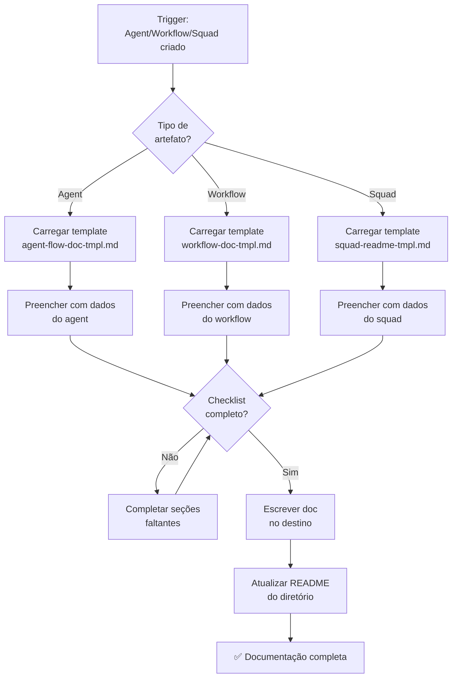

# Create Documentation

**Squad:** squad-creator
**Phase:** Operationalization (Fase 3 do pipeline)
**Agent:** @pedro-valerio
**Pattern:** SC-DP-* (Documentation Patterns)

## Purpose

Criar documentação completa e padronizada para cada artefato do squad-creator.

**REGRA ABSOLUTA:** Nenhum agent, workflow ou squad é considerado completo sem documentação no padrão especificado.

---

## Veto Conditions

| Trigger | Ação |
|---------|------|
| Agent criado sem agent-flow doc | **VETO** - criar documentação antes de marcar done |
| Workflow criado sem workflow doc | **VETO** - criar documentação antes de marcar done |
| Squad criado sem README completo | **VETO** - criar README antes de marcar done |
| Doc sem diagrama Mermaid | **VETO** - adicionar diagrama |
| Doc sem troubleshooting | **VETO** - adicionar seção |

---

## Invocação

### Automática

Triggered automaticamente após:
- `*create-agent` → Cria agent-flow doc
- `*create-workflow` → Cria workflow doc
- `*create-squad` → Cria/atualiza README

### Manual

```
@pedro-valerio
*create-doc {nome-do-artefato}
```

**Exemplos:**
- `*create-doc hormozi-offers` → Cria agent-flow doc
- `*create-doc wf-create-squad` → Cria workflow doc
- `*create-doc hormozi` → Atualiza README do squad

---

## Roteamento por Tipo de Artefato

| Artefato Criado | Tipo de Doc | Template | Destino |
|-----------------|-------------|----------|---------|
| Agent | Agent Flow Doc | `agent-flow-doc-tmpl.md` | `docs/guides/aios-agent-flows/{agent}-system.md` |
| Workflow | Workflow Doc | `workflow-doc-tmpl.md` | `docs/guides/aios-workflows/{workflow}-workflow.md` |
| Squad | README | `squad-readme-tmpl.md` | `squads/{squad}/README.md` |

---

## Conteúdo Obrigatório por Tipo

### SC-DP-001: Agent Flow Doc

| Seção | Obrigatório |
|-------|-------------|
| Visão geral com propósito | ✅ |
| Lista completa de arquivos | ✅ |
| Flowchart Mermaid do sistema | ✅ |
| Mapeamento comando → task | ✅ |
| Diagrama de colaboração | ✅ |
| Best practices | ✅ |
| Troubleshooting (3+ problemas) | ✅ |
| Referências | ✅ |
| Changelog | ✅ |

### SC-DP-002: Workflow Doc

| Seção | Obrigatório |
|-------|-------------|
| Visão geral com objetivo | ✅ |
| **3 diagramas Mermaid** (flowchart, state, sequence) | ✅ |
| Steps detalhados com inputs/outputs | ✅ |
| Veto conditions por step | ✅ |
| Agentes participantes com comandos | ✅ |
| Mapa de tasks por fase | ✅ |
| Pré-requisitos | ✅ |
| Entradas e saídas do workflow | ✅ |
| Pontos de decisão com diagrama | ✅ |
| Condições de bloqueio (HALT) | ✅ |
| Troubleshooting (3+ problemas) | ✅ |
| Changelog | ✅ |

### SC-DP-003: Squad README

| Seção | Obrigatório |
|-------|-------------|
| Descrição clara do propósito | ✅ |
| Tabela de agents com papéis | ✅ |
| Estrutura de diretórios | ✅ |
| Quick start funcional | ✅ |
| Lista de workflows | ✅ |
| Comandos por agent | ✅ |
| Veto conditions | ✅ |
| Links para docs completas | ✅ |

---

## Execution Flow



---

## Integração no Pipeline

```
AN extrai conhecimento → PV operacionaliza → PV documenta → Chief monta
                                              ↑
                                    Esta task (create-documentation)
```

### Posição no Fluxo

| Fase | Responsável | Ação | Task |
|------|-------------|------|------|
| 1 | @oalanicolas | Extrai conhecimento | `extract-*.md` |
| 2 | @pedro-valerio | Operacionaliza (SOPs, checklists) | `extract-sop.md`, etc |
| **3** | **@pedro-valerio** | **Documenta** | **`create-documentation.md`** |
| 4 | @squad-chief | Monta squad final | `create-squad.md` |

---

## Integração com Outros Tasks

### Chamado Automaticamente Por

| Task | Quando |
|------|--------|
| `create-agent.md` | Após agent criado com sucesso |
| `create-workflow.md` | Após workflow criado com sucesso |
| `create-squad.md` | Após squad criado com sucesso |
| `upgrade-squad.md` | Se doc não existe ou está desatualizada |

### Pode Chamar

| Task | Quando |
|------|--------|
| `validate-squad.md` | Após criar README do squad |

---

## Output Schema

```yaml
documentation_output:
  artefato:
    name: string
    type: agent|workflow|squad
    version: string
  documento:
    pattern: SC-DP-001|SC-DP-002|SC-DP-003
    template_used: string
    path: string
    sections_completed: number
    total_sections: number
  diagramas:
    - type: flowchart|state|sequence
      presente: boolean
  validacao:
    checklist_score: percentage
    troubleshooting_count: number
    mermaid_present: boolean
  metadata:
    generated_date: string
    generator: "@pedro-valerio"
    task: create-documentation
```

---

## Completion Criteria

| Critério | Obrigatório |
|----------|-------------|
| Doc criada no path correto | ✅ |
| Template seguido 100% | ✅ |
| Diagramas Mermaid presentes | ✅ |
| Troubleshooting com 3+ itens | ✅ |
| README do diretório atualizado | ✅ |
| Checklist de qualidade 100% | ✅ |

---

## Templates

| Pattern ID | Nome | Arquivo |
|------------|------|---------|
| SC-DP-001 | Agent Flow Documentation | `templates/agent-flow-doc-tmpl.md` |
| SC-DP-002 | Workflow Documentation | `templates/workflow-doc-tmpl.md` |
| SC-DP-003 | Squad README | `templates/squad-readme-tmpl.md` |

---

*Task criada por @pedro-valerio — "Se não está documentado, não existe"*
