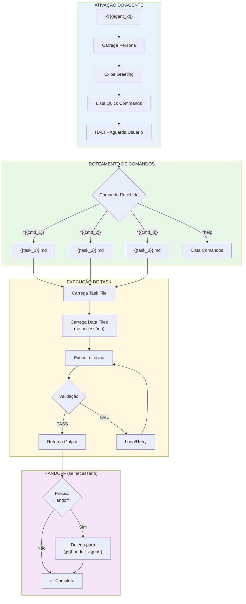
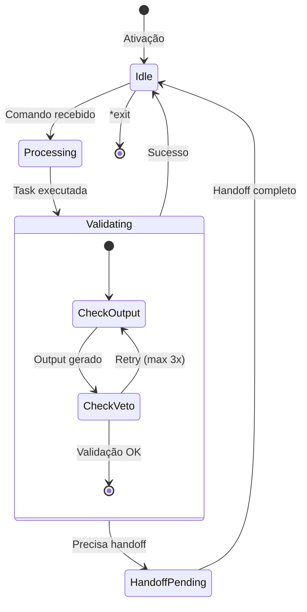
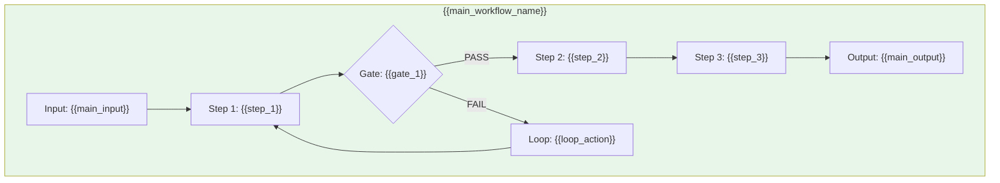
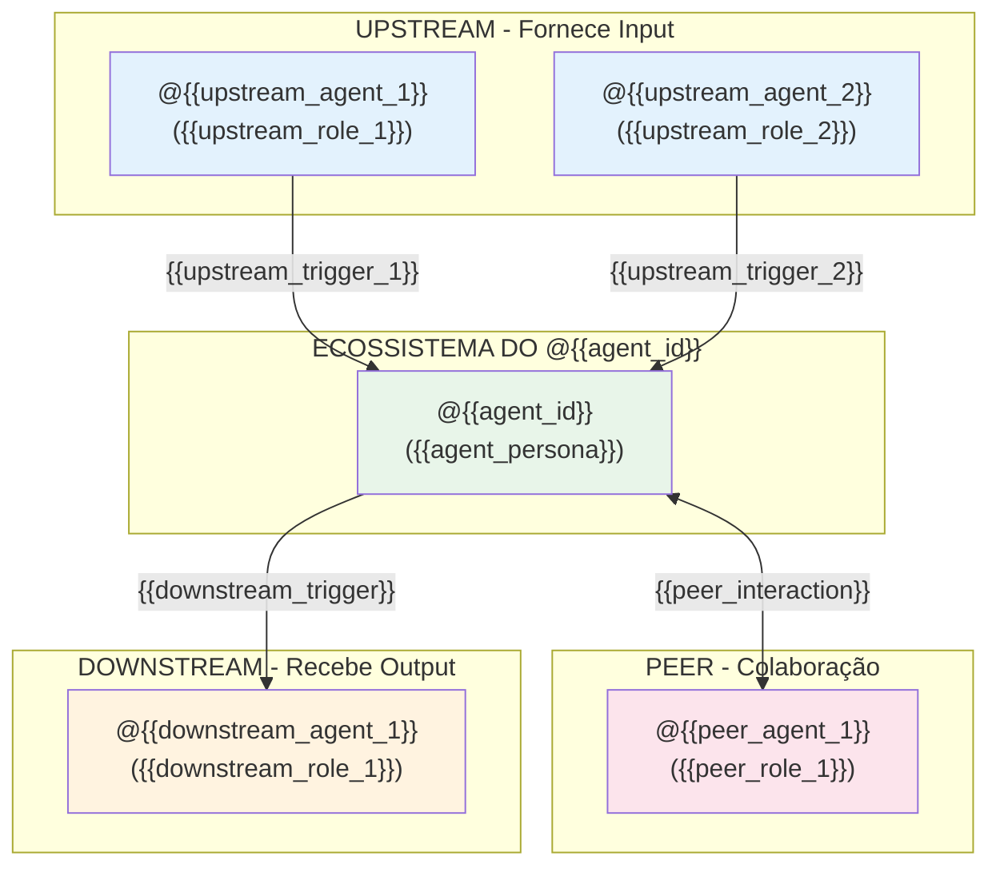

# Sistema do Agente @{{agent_id}}

> **Versão:** 1.0.0
> **Criado:** {{date}}
> **Owner:** @{{agent_id}} ({{agent_persona}})
> **Status:** Documentação Oficial
> **Pattern:** SC-DP-001 (Agent Flow Documentation)

---

## Visão Geral

O agente **@{{agent_id}} ({{agent_persona}})** é {{agent_description}}. Este agente atua como um **{{agent_archetype}}** que {{agent_focus}}.

### Características Principais

| Característica | Descrição |
|----------------|-----------|
| **Persona** | {{agent_persona}} |
| **Arquétipo** | {{agent_archetype}} |
| **Tom** | {{agent_tone}} |
| **Foco** | {{agent_focus}} |
| **Fechamento** | "{{signature_closing}}" |

### Vocabulário Característico

- {{vocab_1}}
- {{vocab_2}}
- {{vocab_3}}
- {{vocab_4}}
- {{vocab_5}}

---

## Lista Completa de Arquivos

### Arquivos Core de Tasks do @{{agent_id}}

| Arquivo | Comando | Propósito |
|---------|---------|-----------|
| `{{squad_path}}/tasks/{{task_1}}.md` | `*{{cmd_1}}` | {{task_1_desc}} |
| `{{squad_path}}/tasks/{{task_2}}.md` | `*{{cmd_2}}` | {{task_2_desc}} |
| `{{squad_path}}/tasks/{{task_3}}.md` | `*{{cmd_3}}` | {{task_3_desc}} |

### Arquivos de Definição do Agente

| Arquivo | Propósito |
|---------|-----------|
| `{{squad_path}}/agents/{{agent_id}}.md` | Definição core do agente (persona, comandos, workflows) |
| `.claude/commands/{{squad_name}}/agents/{{agent_id}}.md` | Comando Claude Code para ativar |

### Arquivos de Data/Knowledge Usados pelo @{{agent_id}}

| Arquivo | Propósito |
|---------|-----------|
| `{{squad_path}}/data/{{data_1}}.yaml` | {{data_1_desc}} |
| `{{squad_path}}/data/{{data_2}}.yaml` | {{data_2_desc}} |

### Arquivos de Checklists Usados pelo @{{agent_id}}

| Arquivo | Propósito |
|---------|-----------|
| `{{squad_path}}/checklists/{{checklist_1}}.md` | {{checklist_1_desc}} |
| `{{squad_path}}/checklists/{{checklist_2}}.md` | {{checklist_2_desc}} |

### Arquivos Relacionados de Outros Agentes

| Arquivo | Agente | Propósito |
|---------|--------|-----------|
| `{{squad_path}}/tasks/{{related_task_1}}.md` | @{{related_agent_1}} | {{related_task_1_desc}} |
| `{{squad_path}}/tasks/{{related_task_2}}.md` | @{{related_agent_2}} | {{related_task_2_desc}} |

### Arquivos de Workflows que Usam @{{agent_id}}

| Arquivo | Propósito |
|---------|-----------|
| `{{squad_path}}/workflows/{{workflow_1}}.yaml` | {{workflow_1_desc}} |
| `{{squad_path}}/workflows/{{workflow_2}}.yaml` | {{workflow_2_desc}} |

---

## Flowchart: Sistema Completo do @{{agent_id}}



### Diagrama de Estados do @{{agent_id}}



### Fluxo de {{main_workflow_name}}



---

## Mapeamento de Comandos para Tasks

### Comandos Principais

| Comando | Task File | Operação |
|---------|-----------|----------|
| `*{{cmd_1}}` | `{{task_1}}.md` | {{cmd_1_operation}} |
| `*{{cmd_2}}` | `{{task_2}}.md` | {{cmd_2_operation}} |
| `*{{cmd_3}}` | `{{task_3}}.md` | {{cmd_3_operation}} |

### Comandos de Validação

| Comando | Task File | Operação |
|---------|-----------|----------|
| `*{{validate_cmd_1}}` | `{{validate_task_1}}.md` | {{validate_cmd_1_operation}} |
| `*{{validate_cmd_2}}` | `{{validate_task_2}}.md` | {{validate_cmd_2_operation}} |

### Comandos de Contexto e Sessão

| Comando | Operação |
|---------|----------|
| `*help` | Mostra todos os comandos disponíveis |
| `*exit` | Sai do modo do agente |

---

## Integrações entre Agentes

### Diagrama de Colaboração



### Fluxo de Colaboração

| De | Para | Trigger | Ação |
|----|------|---------|------|
| @{{upstream_agent_1}} | @{{agent_id}} | {{collab_trigger_1}} | {{collab_action_1}} |
| @{{agent_id}} | @{{peer_agent_1}} | {{collab_trigger_2}} | {{collab_action_2}} |
| @{{agent_id}} | @{{downstream_agent_1}} | {{collab_trigger_3}} | {{collab_action_3}} |
| @{{peer_agent_1}} | @{{agent_id}} | {{collab_trigger_4}} | {{collab_action_4}} |

### Handoff Rules

| Domínio | Trigger | Destino |
|---------|---------|---------|
| {{handoff_domain_1}} | {{handoff_trigger_1}} | @{{handoff_dest_1}} |
| {{handoff_domain_2}} | {{handoff_trigger_2}} | @{{handoff_dest_2}} |
| {{handoff_domain_3}} | {{handoff_trigger_3}} | @{{handoff_dest_3}} |

---

## Veto Conditions

### Condições que Bloqueiam Execução

| Trigger | Ação | Severidade |
|---------|------|------------|
| {{veto_trigger_1}} | {{veto_action_1}} | CRITICAL |
| {{veto_trigger_2}} | {{veto_action_2}} | HIGH |
| {{veto_trigger_3}} | {{veto_action_3}} | MEDIUM |

### Blocking Conditions

O @{{agent_id}} deve **HALT** e perguntar ao usuário quando:
- {{blocking_1}}
- {{blocking_2}}
- {{blocking_3}}

---

## Configuração

### Arquivos de Configuração Relevantes

| Arquivo | Propósito |
|---------|-----------|
| `{{squad_path}}/config.yaml` | Configuração do squad |
| `{{squad_path}}/agents/{{agent_id}}.md` | Definição do agente |

### Mission Router

```yaml
# Mapeamento comando → arquivo
mission_router:
  "*{{cmd_1}}": "tasks/{{task_1}}.md"
  "*{{cmd_2}}": "tasks/{{task_2}}.md"
  "*{{cmd_3}}": "tasks/{{task_3}}.md"

# Data files carregados por comando
data_loading:
  "*{{cmd_1}}":
    - "data/{{data_1}}.yaml"
  "*{{cmd_2}}":
    - "data/{{data_2}}.yaml"
```

### Lazy Loading Strategy

```yaml
# Arquivos carregados APENAS quando necessários
lazy_load:
  tasks/: "Carregado quando comando é invocado"
  data/: "Carregado quando task precisa"
  checklists/: "Carregado em validações"

# NUNCA carregar na ativação
never_preload:
  - "data/*.yaml"
  - "tasks/*.md"
```

---

## Best Practices

### Quando Usar o @{{agent_id}}

**USE @{{agent_id}} para:**
- {{use_case_1}}
- {{use_case_2}}
- {{use_case_3}}
- {{use_case_4}}

**NÃO USE @{{agent_id}} para:**
- {{dont_use_1}} (use @{{alternative_1}})
- {{dont_use_2}} (use @{{alternative_2}})
- {{dont_use_3}} (use @{{alternative_3}})

### Ciclo de Execução Recomendado

1. **Ative o agente** com `@{{agent_id}}`
2. **Aguarde o greeting** antes de enviar comandos
3. **Use comandos específicos** (`*{{cmd_1}}`, etc)
4. **Valide output** antes de prosseguir
5. **Faça handoff** se necessário

### Convenções

| Aspecto | Convenção |
|---------|-----------|
| Comandos | Sempre com `*` prefix |
| Argumentos | Entre `{}` ou após espaço |
| Paths | Relativos ao squad |
| Data files | YAML format |
| Task files | Markdown format |

---

## Troubleshooting

### Comando não reconhecido

```
Erro: Comando '*xyz' não encontrado no mission router
```

**Causas:**
- Typo no comando
- Comando não existe para este agente
- Agente não foi ativado corretamente

**Solução:**
1. Verificar lista de comandos com `*help`
2. Confirmar spelling do comando
3. Reativar agente se necessário

### Task file não encontrado

```
Erro: Task file not found at {{squad_path}}/tasks/xyz.md
```

**Causas:**
- Path incorreto no mission router
- Arquivo não existe
- Typo no nome do arquivo

**Solução:**
1. Verificar mission router no arquivo do agente
2. Listar arquivos: `ls {{squad_path}}/tasks/`
3. Corrigir path se necessário

### Data file não carrega

```
Erro: Data file not found or invalid YAML
```

**Causas:**
- Arquivo não existe
- YAML syntax error
- Path incorreto

**Solução:**
1. Verificar se arquivo existe
2. Validar YAML syntax
3. Corrigir path no mission router

### Veto condition acionada

```
Erro: VETO - {{veto_message}}
```

**Causas:**
- Condição de bloqueio atingida
- Validação falhou
- Input inválido

**Solução:**
1. Verificar mensagem de veto
2. Corrigir condição que causou veto
3. Re-executar comando

### Handoff falha

```
Erro: Handoff para @xyz falhou - agente não encontrado
```

**Causas:**
- Agente destino não existe
- Nome do agente incorreto
- Agente destino não está no squad

**Solução:**
1. Verificar handoff rules no agente
2. Confirmar que agente destino existe
3. Verificar config.yaml do squad

---

## Referências

### Tasks do @{{agent_id}}

| Task | Path |
|------|------|
| {{task_1}} | `{{squad_path}}/tasks/{{task_1}}.md` |
| {{task_2}} | `{{squad_path}}/tasks/{{task_2}}.md` |
| {{task_3}} | `{{squad_path}}/tasks/{{task_3}}.md` |

### Checklists

| Checklist | Path |
|-----------|------|
| {{checklist_1}} | `{{squad_path}}/checklists/{{checklist_1}}.md` |
| {{checklist_2}} | `{{squad_path}}/checklists/{{checklist_2}}.md` |

### Data Files

| Data | Path |
|------|------|
| {{data_1}} | `{{squad_path}}/data/{{data_1}}.yaml` |
| {{data_2}} | `{{squad_path}}/data/{{data_2}}.yaml` |

### Agente

| Arquivo | Path |
|---------|------|
| Agent Definition | `{{squad_path}}/agents/{{agent_id}}.md` |
| Claude Command | `.claude/commands/{{squad_name}}/agents/{{agent_id}}.md` |

### Workflows

| Workflow | Path |
|----------|------|
| {{workflow_1}} | `{{squad_path}}/workflows/{{workflow_1}}.yaml` |
| {{workflow_2}} | `{{squad_path}}/workflows/{{workflow_2}}.yaml` |

### Documentação Relacionada

| Documento | Path |
|-----------|------|
| Squad README | `{{squad_path}}/README.md` |
| Concepts | `{{squad_path}}/docs/CONCEPTS.md` |
| FAQ | `{{squad_path}}/docs/FAQ.md` |

---

## Resumo

| Aspecto | Detalhes |
|---------|----------|
| **Total de Tasks** | {{total_tasks}} task files |
| **Comandos Principais** | {{total_commands}} comandos |
| **Data Files** | {{total_data}} arquivos |
| **Checklists** | {{total_checklists}} checklists |
| **Workflows Integrados** | {{total_workflows}} workflows |
| **Agentes Colaboradores** | {{total_collaborators}} (@{{collab_list}}) |
| **Veto Conditions** | {{total_vetos}} condições |
| **Handoff Rules** | {{total_handoffs}} regras |

---

## Changelog

| Data | Autor | Descrição |
|------|-------|-----------|
| {{date}} | @{{creator}} | Documento inicial criado |

---

*{{signature_closing}}*

---

*Documentação gerada seguindo SC-DP-001 (Agent Flow Documentation)*
*Padrão baseado em: docs/guides/aios-agent-flows/*
