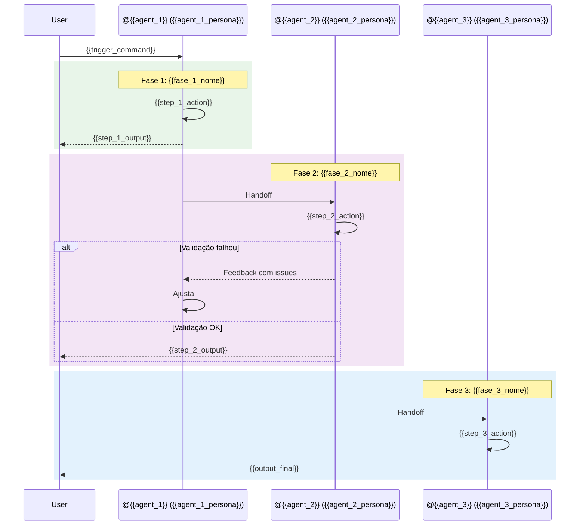
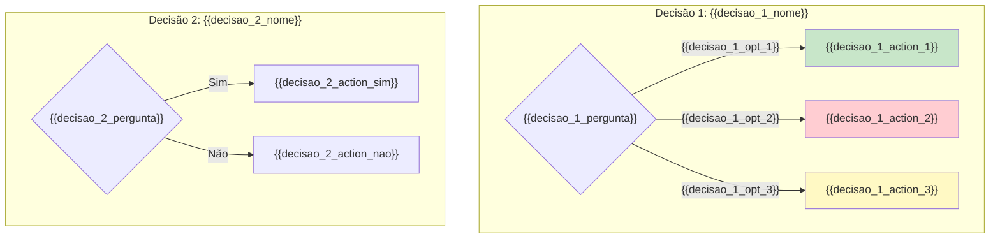

# Workflow: {{workflow_name}}

> **Versão:** 1.0.0
> **Criado:** {{date}}
> **Owner:** @{{owner_agent}} ({{owner_persona}})
> **Status:** Documentação Oficial
> **Pattern:** SC-DP-002 (Workflow Documentation)

---

## Índice

1. [Visão Geral](#visão-geral)
2. [Lista Completa de Arquivos](#lista-completa-de-arquivos)
3. [Diagramas do Workflow](#diagramas-do-workflow)
4. [Steps Detalhados](#steps-detalhados)
5. [Agentes Participantes](#agentes-participantes)
6. [Tasks Executadas](#tasks-executadas)
7. [Pré-requisitos](#pré-requisitos)
8. [Entradas e Saídas](#entradas-e-saídas)
9. [Pontos de Decisão](#pontos-de-decisão)
10. [Configuração](#configuração)
11. [Modos de Execução](#modos-de-execução)
12. [Best Practices](#best-practices)
13. [Troubleshooting](#troubleshooting)
14. [Referências](#referências)
15. [Resumo](#resumo)
16. [Changelog](#changelog)

---

## Visão Geral

O workflow **{{workflow_name}}** {{workflow_description}}. Este workflow automatiza o fluxo completo de {{workflow_scope}}.

### Objetivo

{{workflow_objective}}

### Tipos de Projeto Suportados

| Tipo | Descrição | Exemplo |
|------|-----------|---------|
| `{{tipo_1}}` | {{tipo_1_desc}} | {{tipo_1_example}} |
| `{{tipo_2}}` | {{tipo_2_desc}} | {{tipo_2_example}} |
| `{{tipo_3}}` | {{tipo_3_desc}} | {{tipo_3_example}} |

### Quando Usar Este Workflow

**USE este workflow para:**
- {{use_case_1}}
- {{use_case_2}}
- {{use_case_3}}
- {{use_case_4}}

**NÃO USE este workflow para:**

| Situação | Alternativa |
|----------|-------------|
| {{dont_use_1}} | {{alternative_1}} |
| {{dont_use_2}} | {{alternative_2}} |
| {{dont_use_3}} | {{alternative_3}} |

---

## Lista Completa de Arquivos

### Arquivo de Definição do Workflow

| Arquivo | Propósito |
|---------|-----------|
| `{{squad_path}}/workflows/{{workflow_file}}.yaml` | Definição YAML do workflow |
| `.claude/commands/{{squad_name}}/workflows/{{workflow_file}}.yaml` | Comando Claude Code |

### Tasks Executadas pelo Workflow

| Arquivo | Step | Propósito |
|---------|------|-----------|
| `{{squad_path}}/tasks/{{task_1}}.md` | Step 1 | {{task_1_desc}} |
| `{{squad_path}}/tasks/{{task_2}}.md` | Step 2 | {{task_2_desc}} |
| `{{squad_path}}/tasks/{{task_3}}.md` | Step 3 | {{task_3_desc}} |

### Agentes Envolvidos

| Arquivo | Agente | Papel no Workflow |
|---------|--------|-------------------|
| `{{squad_path}}/agents/{{agent_1}}.md` | @{{agent_1}} | {{agent_1_role}} |
| `{{squad_path}}/agents/{{agent_2}}.md` | @{{agent_2}} | {{agent_2_role}} |

### Checklists Utilizados

| Arquivo | Step | Propósito |
|---------|------|-----------|
| `{{squad_path}}/checklists/{{checklist_1}}.md` | {{checklist_1_step}} | {{checklist_1_desc}} |
| `{{squad_path}}/checklists/{{checklist_2}}.md` | {{checklist_2_step}} | {{checklist_2_desc}} |

### Data Files Carregados

| Arquivo | Step | Propósito |
|---------|------|-----------|
| `{{squad_path}}/data/{{data_1}}.yaml` | {{data_1_step}} | {{data_1_desc}} |
| `{{squad_path}}/data/{{data_2}}.yaml` | {{data_2_step}} | {{data_2_desc}} |

### Outputs Gerados

| Arquivo | Destino | Descrição |
|---------|---------|-----------|
| `{{output_1}}` | `{{output_1_path}}` | {{output_1_desc}} |
| `{{output_2}}` | `{{output_2_path}}` | {{output_2_desc}} |

---

## Diagramas do Workflow

### Fluxo Principal

```mermaid
flowchart TD
    subgraph PHASE_1["Fase 1: {{fase_1_nome}}"]
        START([Trigger: {{trigger}}]) --> STEP_1["@{{agent_1}}: {{step_1}}<br/>Task: {{task_1}}"]
        STEP_1 --> GATE_1{"{{gate_1}}"}
        GATE_1 -->|PASS| STEP_2["@{{agent_2}}: {{step_2}}<br/>Task: {{task_2}}"]
        GATE_1 -->|FAIL| FEEDBACK_1["Feedback Loop"]
        FEEDBACK_1 --> STEP_1
    end

    subgraph PHASE_2["Fase 2: {{fase_2_nome}}"]
        STEP_2 --> STEP_3["@{{agent_3}}: {{step_3}}<br/>Task: {{task_3}}"]
        STEP_3 --> GATE_2{"{{gate_2}}"}
        GATE_2 -->|PASS| OUTPUT["📦 Output: {{output_final}}"]
        GATE_2 -->|FAIL| FEEDBACK_2["Feedback Loop"]
        FEEDBACK_2 --> STEP_2
    end

    subgraph COMPLETION["Conclusão"]
        OUTPUT --> DONE([Workflow Completo])
        DONE --> MORE{Mais itens?}
        MORE -->|Sim| START
        MORE -->|Não| END([FIM])
    end

    style PHASE_1 fill:#e8f5e9
    style PHASE_2 fill:#f3e5f5
    style COMPLETION fill:#e3f2fd
    style DONE fill:#90EE90
```

### Diagrama de Estados

```mermaid
stateDiagram-v2
    [*] --> {{estado_inicial}}: Trigger

    {{estado_inicial}} --> {{estado_1}}: {{transicao_1}}
    {{estado_1}} --> {{estado_1}}: {{loop_condition}}
    {{estado_1}} --> {{estado_2}}: {{transicao_2}}

    {{estado_2}} --> {{estado_3}}: {{transicao_3}}
    {{estado_3}} --> {{estado_2}}: {{rejection_condition}}
    {{estado_3}} --> Completed: {{success_condition}}

    Completed --> [*]
    {{estado_2}} --> Escalated: {{escalation_condition}}
    Escalated --> [*]: Intervenção Humana

    note right of {{estado_inicial}} : Estado inicial
    note right of Completed : Workflow concluído com sucesso
```

### Diagrama de Sequência



---

## Steps Detalhados

### Step 1: {{step_1_nome}} (Fase 1)

| Campo | Valor |
|-------|-------|
| **ID** | `{{step_1_id}}` |
| **Fase** | 1 - {{fase_1_nome}} |
| **Agente** | @{{step_1_agent}} ({{step_1_agent_persona}}) |
| **Ação** | {{step_1_acao}} |
| **Task** | `{{step_1_task}}.md` |
| **Timeout** | {{step_1_timeout}} |

#### Descrição

{{step_1_descricao}}

#### Inputs

| Input | Tipo | Origem | Obrigatório |
|-------|------|--------|-------------|
| `{{input_1_1}}` | {{input_1_1_type}} | {{input_1_1_origin}} | Sim |
| `{{input_1_2}}` | {{input_1_2_type}} | {{input_1_2_origin}} | Não |

#### Outputs

| Output | Tipo | Destino |
|--------|------|---------|
| `{{output_1_1}}` | {{output_1_1_type}} | {{output_1_1_dest}} |
| `{{output_1_1_file}}` | arquivo | {{output_1_1_path}} |

#### Critérios de Sucesso

- [ ] {{criterio_1_1}}
- [ ] {{criterio_1_2}}
- [ ] {{criterio_1_3}}

#### Veto Conditions

| Trigger | Ação |
|---------|------|
| {{veto_1_1_trigger}} | {{veto_1_1_action}} |
| {{veto_1_2_trigger}} | {{veto_1_2_action}} |

#### Status Transitions

- **Antes:** {{status_before_1}}
- **Durante:** {{status_during_1}}
- **Depois (Sucesso):** {{status_after_success_1}}
- **Depois (Falha):** {{status_after_fail_1}}

---

### Step 2: {{step_2_nome}} (Fase 2)

| Campo | Valor |
|-------|-------|
| **ID** | `{{step_2_id}}` |
| **Fase** | 2 - {{fase_2_nome}} |
| **Agente** | @{{step_2_agent}} ({{step_2_agent_persona}}) |
| **Ação** | {{step_2_acao}} |
| **Task** | `{{step_2_task}}.md` |
| **Requer** | `{{step_2_requires}}` |

#### Descrição

{{step_2_descricao}}

#### Inputs

| Input | Tipo | Origem | Obrigatório |
|-------|------|--------|-------------|
| `{{input_2_1}}` | {{input_2_1_type}} | {{input_2_1_origin}} | Sim |
| `{{input_2_2}}` | {{input_2_2_type}} | Output do Step anterior | Sim |

#### Outputs

| Output | Tipo | Destino |
|--------|------|---------|
| `{{output_2_1}}` | {{output_2_1_type}} | {{output_2_1_dest}} |

#### Critérios de Sucesso

- [ ] {{criterio_2_1}}
- [ ] {{criterio_2_2}}

#### Status Transitions

- **Antes:** {{status_before_2}}
- **Depois (Sucesso):** {{status_after_success_2}}
- **Depois (Falha):** {{status_after_fail_2}}

---

### Step 3: {{step_3_nome}} (Fase 3)

| Campo | Valor |
|-------|-------|
| **ID** | `{{step_3_id}}` |
| **Fase** | 3 - {{fase_3_nome}} |
| **Agente** | @{{step_3_agent}} ({{step_3_agent_persona}}) |
| **Ação** | {{step_3_acao}} |
| **Task** | `{{step_3_task}}.md` |
| **Requer** | `{{step_3_requires}}` |

#### Descrição

{{step_3_descricao}}

#### Inputs

| Input | Tipo | Origem | Obrigatório |
|-------|------|--------|-------------|
| `{{input_3_1}}` | {{input_3_1_type}} | {{input_3_1_origin}} | Sim |

#### Outputs

| Output | Tipo | Destino |
|--------|------|---------|
| `{{output_3_1}}` | {{output_3_1_type}} | {{output_3_1_dest}} |

#### Critérios de Sucesso

- [ ] {{criterio_3_1}}
- [ ] {{criterio_3_2}}

#### On Success

```yaml
log: "{{step_3_success_log}}"
next: {{step_3_next}}
```

#### On Failure

```yaml
action: retry
max_retries: {{step_3_max_retries}}
on_exhausted: escalate
```

---

## Agentes Participantes

### @{{agent_1}} - {{agent_1_nome}} ({{agent_1_persona}})

| Aspecto | Descrição |
|---------|-----------|
| **Ícone** | {{agent_1_icon}} |
| **Arquétipo** | {{agent_1_archetype}} |
| **Papel no Workflow** | {{agent_1_role}} |
| **Foco** | {{agent_1_focus}} |
| **Responsabilidades** | {{agent_1_responsibilities}} |

**Ferramentas Utilizadas:**

| Ferramenta | Propósito |
|------------|-----------|
| `{{agent_1_tool_1}}` | {{agent_1_tool_1_purpose}} |
| `{{agent_1_tool_2}}` | {{agent_1_tool_2_purpose}} |

**Comandos Relevantes:**
- `*{{agent_1_cmd_1}}` - {{agent_1_cmd_1_desc}}
- `*{{agent_1_cmd_2}}` - {{agent_1_cmd_2_desc}}

---

### @{{agent_2}} - {{agent_2_nome}} ({{agent_2_persona}})

| Aspecto | Descrição |
|---------|-----------|
| **Ícone** | {{agent_2_icon}} |
| **Arquétipo** | {{agent_2_archetype}} |
| **Papel no Workflow** | {{agent_2_role}} |
| **Foco** | {{agent_2_focus}} |
| **Responsabilidades** | {{agent_2_responsibilities}} |

**Ferramentas Utilizadas:**

| Ferramenta | Propósito |
|------------|-----------|
| `{{agent_2_tool_1}}` | {{agent_2_tool_1_purpose}} |
| `{{agent_2_tool_2}}` | {{agent_2_tool_2_purpose}} |

**Comandos Relevantes:**
- `*{{agent_2_cmd_1}}` - {{agent_2_cmd_1_desc}}
- `*{{agent_2_cmd_2}}` - {{agent_2_cmd_2_desc}}

---

## Tasks Executadas

### Mapa de Tasks por Fase

```mermaid
graph TD
    subgraph "Fase 1: {{fase_1_nome}}"
        T1[{{task_1}}.md]
    end

    subgraph "Fase 2: {{fase_2_nome}}"
        T2[{{task_2}}.md]
        T2a[{{task_2a}}.md]
    end

    subgraph "Fase 3: {{fase_3_nome}}"
        T3[{{task_3}}.md]
    end

    T1 --> T2
    T2 --> T2a
    T2a --> T3
```

### Detalhamento das Tasks

| Task | Arquivo | Agente | Propósito |
|------|---------|--------|-----------|
| {{task_1_name}} | `{{task_1}}.md` | @{{agent_1}} | {{task_1_purpose}} |
| {{task_2_name}} | `{{task_2}}.md` | @{{agent_2}} | {{task_2_purpose}} |
| {{task_2a_name}} | `{{task_2a}}.md` | @{{agent_2}} | {{task_2a_purpose}} |
| {{task_3_name}} | `{{task_3}}.md` | @{{agent_3}} | {{task_3_purpose}} |

---

## Pré-requisitos

### Configuração do Projeto

1. **config.yaml** - Arquivo de configuração do squad obrigatório
   - `{{config_field_1}}` - {{config_field_1_desc}}
   - `{{config_field_2}}` - {{config_field_2_desc}}

2. **Templates** - Templates disponíveis em `{{squad_path}}/templates/`
   - `{{template_1}}`
   - `{{template_2}}`

3. **Checklists** - Checklists obrigatórios:
   - `{{checklist_1}}.md`
   - `{{checklist_2}}.md`

### Documentação Prerequisita

| Documento | Local | Obrigatório |
|-----------|-------|-------------|
| {{doc_prereq_1}} | {{doc_prereq_1_path}} | Sim |
| {{doc_prereq_2}} | {{doc_prereq_2_path}} | Sim |
| {{doc_prereq_3}} | {{doc_prereq_3_path}} | Não |

### Ferramentas Integradas

| Ferramenta | Propósito | Agentes |
|------------|-----------|---------|
| `{{tool_1}}` | {{tool_1_purpose}} | {{tool_1_agents}} |
| `{{tool_2}}` | {{tool_2_purpose}} | {{tool_2_agents}} |
| `{{tool_3}}` | {{tool_3_purpose}} | {{tool_3_agents}} |

---

## Entradas e Saídas

### Entradas do Workflow

| Entrada | Tipo | Fonte | Obrigatório | Descrição |
|---------|------|-------|-------------|-----------|
| `{{entrada_1}}` | {{entrada_1_type}} | {{entrada_1_fonte}} | Sim | {{entrada_1_desc}} |
| `{{entrada_2}}` | {{entrada_2_type}} | {{entrada_2_fonte}} | Não | {{entrada_2_desc}} |
| `{{entrada_3}}` | {{entrada_3_type}} | {{entrada_3_fonte}} | Não | {{entrada_3_desc}} |

### Saídas do Workflow

| Saída | Tipo | Destino | Descrição |
|-------|------|---------|-----------|
| `{{saida_1}}` | {{saida_1_type}} | {{saida_1_destino}} | {{saida_1_desc}} |
| `{{saida_2}}` | {{saida_2_type}} | {{saida_2_destino}} | {{saida_2_desc}} |
| `{{saida_3}}` | {{saida_3_type}} | {{saida_3_destino}} | {{saida_3_desc}} |

### Schema de Status (se aplicável)

```yaml
workflowId: string              # ID do workflow
status: enum                    # pending | in_progress | completed | stopped | escalated
currentStep: string             # Step atual
startedAt: ISO-8601             # Timestamp de início
updatedAt: ISO-8601             # Última atualização

history:
  - step: string
    completedAt: ISO-8601
    output: object
    duration: number            # milliseconds
```

---

## Pontos de Decisão

### Diagrama de Decisões



### Pontos de Decisão Detalhados

| Ponto | Fase | Decisor | Critério | Resultado Positivo | Resultado Negativo |
|-------|------|---------|----------|-------------------|-------------------|
| {{ponto_1}} | {{ponto_1_fase}} | @{{ponto_1_decisor}} | {{ponto_1_criterio}} | {{ponto_1_positivo}} | {{ponto_1_negativo}} |
| {{ponto_2}} | {{ponto_2_fase}} | @{{ponto_2_decisor}} | {{ponto_2_criterio}} | {{ponto_2_positivo}} | {{ponto_2_negativo}} |

### Condições de Bloqueio (HALT)

O workflow deve **HALT** e solicitar intervenção do usuário quando:

1. {{halt_condition_1}}
2. {{halt_condition_2}}
3. {{halt_condition_3}}
4. {{halt_condition_4}}
5. {{halt_condition_5}}

### Critérios de Escalação

| Trigger | Razão | Ação |
|---------|-------|------|
| `{{escalation_trigger_1}}` | {{escalation_reason_1}} | Escalar com contexto |
| `{{escalation_trigger_2}}` | {{escalation_reason_2}} | Escalar imediatamente |
| `manual_escalate` | Usuário executou `*escalate` | Escalar sob demanda |

---

## Configuração

### Parâmetros Configuráveis

```yaml
config:
  # Limites de execução
  maxIterations: {{max_iterations}}
  timeout: {{timeout_ms}}           # milliseconds

  # Localização de arquivos
  outputPath: {{output_path}}
  statusFile: {{status_file_path}}

  # Comportamento
  mode: {{default_mode}}            # yolo | interactive | preflight
  verbose: {{verbose}}
  showProgress: {{show_progress}}

  # Retry configuration
  maxRetries: {{max_retries}}
  retryDelay: {{retry_delay}}       # milliseconds
```

### Customização por Projeto

No arquivo `{{squad_path}}/config.yaml`:

```yaml
workflows:
  {{workflow_id}}:
    maxIterations: {{custom_max_iterations}}
    timeout: {{custom_timeout}}
    outputPath: {{custom_output_path}}
```

### Variáveis de Ambiente

| Variável | Descrição | Default |
|----------|-----------|---------|
| `{{env_var_1}}` | {{env_var_1_desc}} | {{env_var_1_default}} |
| `{{env_var_2}}` | {{env_var_2_desc}} | {{env_var_2_default}} |

---

## Modos de Execução

O workflow suporta três modos de execução:

### 1. YOLO Mode (Autônomo)

```yaml
mode: yolo
prompts: 0-1
best_for: Tarefas simples e determinísticas
```

- Decisões autônomas com logging automático
- Mínima interação com usuário
- Gera log de decisões para auditoria

### 2. Interactive Mode (Balanceado) [DEFAULT]

```yaml
mode: interactive
prompts: 5-10
best_for: Aprendizado e decisões complexas
```

- Checkpoints de decisão explícitos
- Explicações educacionais em cada passo
- Confirma entendimento com usuário

### 3. Pre-Flight Mode (Planejamento)

```yaml
mode: preflight
prompts: 10-15 (upfront)
best_for: Requisitos ambíguos e trabalho crítico
```

- Análise completa de ambiguidades antes de iniciar
- Questionário abrangente upfront
- Execução sem ambiguidades após planejamento

---

## Best Practices

### Ciclo de Execução Recomendado

1. **Verifique pré-requisitos** antes de iniciar
2. **Escolha o modo apropriado** (YOLO para simples, Interactive para complexo)
3. **Monitore o progresso** em cada fase
4. **Valide outputs** antes de prosseguir para próxima fase
5. **Documente decisões** em caso de desvios

### Convenções

| Aspecto | Convenção |
|---------|-----------|
| Trigger | `*{{workflow_trigger}}` ou automático |
| Argumentos | Entre `{}` ou após espaço |
| Paths | Relativos ao squad |
| Data files | YAML format |
| Task files | Markdown format |
| Status tracking | JSON format |

### Anti-Patterns a Evitar

- ❌ Pular steps sem validação
- ❌ Ignorar veto conditions
- ❌ Não verificar outputs antes de handoff
- ❌ Executar em YOLO mode com requisitos ambíguos
- ❌ Não documentar decisões de escalação

---

## Troubleshooting

### 1. Workflow não inicia

```
Erro: {{error_1_message}}
```

**Causas:**
- {{error_1_causa_1}}
- {{error_1_causa_2}}
- {{error_1_causa_3}}

**Solução:**
1. {{error_1_solucao_1}}
2. {{error_1_solucao_2}}
3. {{error_1_solucao_3}}

---

### 2. Step falha repetidamente

```
Erro: {{error_2_message}}
```

**Causas:**
- {{error_2_causa_1}}
- {{error_2_causa_2}}

**Diagnóstico:**
```bash
# {{error_2_diagnostico_1}}
{{error_2_comando_1}}

# {{error_2_diagnostico_2}}
{{error_2_comando_2}}
```

**Solução:**
1. {{error_2_solucao_1}}
2. {{error_2_solucao_2}}

---

### 3. Handoff entre agentes falha

```
Erro: {{error_3_message}}
```

**Causas:**
- {{error_3_causa_1}}
- {{error_3_causa_2}}

**Solução:**
1. {{error_3_solucao_1}}
2. {{error_3_solucao_2}}
3. {{error_3_solucao_3}}

---

### 4. Max iterations atingido

```
Erro: Workflow escalated - max iterations reached
```

**Causas:**
- Issues recorrentes não resolvidos
- Critérios de sucesso muito restritivos
- Problema subjacente não identificado

**Diagnóstico:**
```bash
# Ver histórico completo
cat {{status_file_path}} | jq '.history'
```

**Solução:**
1. Analisar pattern de issues recorrentes
2. Verificar se critérios estão claros
3. Considerar aumentar maxIterations ou resolver manualmente

---

### 5. Output corrompido ou incompleto

```
Erro: {{error_5_message}}
```

**Causas:**
- {{error_5_causa_1}}
- {{error_5_causa_2}}

**Solução:**
1. {{error_5_solucao_1}}
2. {{error_5_solucao_2}}
3. Reiniciar workflow com `*{{workflow_trigger}} --reset`

---

### Logs e Diagnóstico

| Arquivo | Local | Conteúdo |
|---------|-------|----------|
| Status File | `{{status_file_path}}` | Status atual do workflow |
| Decision Log | `{{decision_log_path}}` | Decisões autônomas (modo YOLO) |
| Output Files | `{{output_path}}` | Artefatos gerados |

---

## Referências

### Arquivos do Workflow

| Arquivo | Caminho |
|---------|---------|
| Workflow Definition | `{{squad_path}}/workflows/{{workflow_file}}.yaml` |
| Task 1 | `{{squad_path}}/tasks/{{task_1}}.md` |
| Task 2 | `{{squad_path}}/tasks/{{task_2}}.md` |
| Task 3 | `{{squad_path}}/tasks/{{task_3}}.md` |
| Agent 1 | `{{squad_path}}/agents/{{agent_1}}.md` |
| Agent 2 | `{{squad_path}}/agents/{{agent_2}}.md` |

### Checklists

| Checklist | Caminho |
|-----------|---------|
| {{checklist_1_name}} | `{{squad_path}}/checklists/{{checklist_1}}.md` |
| {{checklist_2_name}} | `{{squad_path}}/checklists/{{checklist_2}}.md` |

### Data Files

| Data | Caminho |
|------|---------|
| {{data_1_name}} | `{{squad_path}}/data/{{data_1}}.yaml` |
| {{data_2_name}} | `{{squad_path}}/data/{{data_2}}.yaml` |

### Templates

| Template | Caminho | Uso |
|----------|---------|-----|
| {{template_1_name}} | `{{squad_path}}/templates/{{template_1}}` | {{template_1_uso}} |
| {{template_2_name}} | `{{squad_path}}/templates/{{template_2}}` | {{template_2_uso}} |

### Documentação Relacionada

| Documento | Caminho |
|-----------|---------|
| Squad README | `{{squad_path}}/README.md` |
| Concepts | `{{squad_path}}/docs/CONCEPTS.md` |
| FAQ | `{{squad_path}}/docs/FAQ.md` |

---

## Resumo

| Aspecto | Detalhes |
|---------|----------|
| **Total de Steps** | {{total_steps}} steps |
| **Fases** | {{total_phases}} fases |
| **Agentes Envolvidos** | {{total_agents}} (@{{agents_list}}) |
| **Tasks Executadas** | {{total_tasks}} tasks |
| **Checklists** | {{total_checklists}} checklists |
| **Data Files** | {{total_data}} arquivos |
| **Pontos de Decisão** | {{total_decisions}} decisões |
| **Condições de HALT** | {{total_halts}} condições |
| **Modos de Execução** | YOLO, Interactive, Pre-Flight |

---

## Changelog

| Versão | Data | Autor | Mudanças |
|--------|------|-------|----------|
| 1.0.0 | {{date}} | @{{creator}} | Documento inicial criado |

---

*{{signature_closing}}*

---

*Documentação gerada seguindo SC-DP-002 (Workflow Documentation)*
*Padrão baseado em: docs/guides/aios-workflows/*
